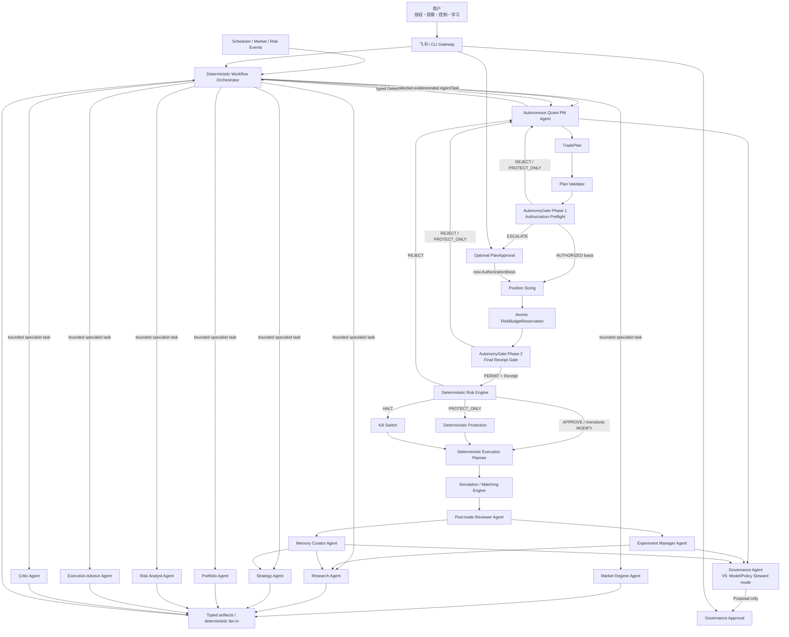

# 多 Agent 与量化工具体系设计

版本：`2.1-proposed`  
项目性质：Greenfield 全新项目  
日期：2026-08-18

## 1. 设计目标

本系统的最终形态不是“一个模型加几十个工具”，也不是“很多 Agent 投票决定买卖”，而是一个分工明确的 Agent Quant Operating System：

- 专业 Agent 处理不确定、高语义、需要综合证据的工作。
- 确定性服务处理有唯一答案或必须审计的计算与状态。
- Main Agent 负责专业决策协调和对用户解释，不负责可靠调度，也不拥有风险豁免权。
- Main Agent 的产品角色是 `Autonomous Quant PM Agent`：在有效的模拟交易自治委托内，主动发现机会、作出交易或不交易决策并管理完整 Episode；它不是等待用户逐笔指挥的聊天助手。
- 定时、事件、重试和状态推进由确定性的 `Workflow Orchestrator` 负责；不能依赖 LLM 自己保持长循环。
- 所有 Agent 都通过 Tool Gateway 工作，不能直接读写交易数据库。
- 专业 Agent 按需启动；“逻辑角色完整”不等于“所有模型常驻”。

## 2. 最终 Agent 组织



## 3. Agent 分层

### 3.1 编排层

- `Workflow Orchestrator` 是确定性运行时，负责 schedule/event 触发、任务状态、重试、幂等、checkpoint、deadline 和取消；它不是 LLM Agent。
- Main Agent / Autonomous Quant PM 是单一决策责任主体，负责主动筛选候选、选择专家、合并证据、形成 `TRADE/NO_TRADE/DEFER` 决策和解释结果。
- Main 只能在 `EffectiveAutonomy` 成立时自主推进模拟交易；只有 Authorization Preflight 返回 `ESCALATE` 时才可创建可选单次 PlanApproval 请求，等待期间不占用风险预算。
- 不把“最终回答”误当交易许可；所有副作用走应用命令与硬门禁。

### 3.2 研究与决策专家层

- Market Regime Agent。
- Research Agent。
- Strategy Agent。
- Portfolio Agent。
- Risk Analyst Agent。
- Execution Advisor Agent。
- Critic Agent。

### 3.3 复盘与演进专家层

- Post-trade Reviewer Agent。
- Experiment Manager Agent。
- Memory Curator Agent。
- Governance Agent（V5 扩展 Model/Policy Steward 工作模式）。

### 3.4 非 Agent 真值层

以下名称即使带有“智能”含义，也不属于 LLM Agent：

- Market State Builder。
- Signal/Forecast Models。
- Feature Engine。
- Portfolio Optimizer。
- Position Sizing Engine。
- Risk Engine / Risk Constitution。
- Execution Planner。
- Matching Engine。
- Accounting / PnL / Margin / Settlement Engine。
- Position Protection System。
- Backtest Engine。
- Experiment Registry / Model Registry / Audit Log。

### 3.5 运行契约总表

各角色实际需要 LLM 的业务内容、默认能力档位和版本化模型路由见 [`LLM-SCENARIO-AND-MODEL-ROUTING.md`](./LLM-SCENARIO-AND-MODEL-ROUTING.md)。Agent 角色不等于固定模型或独立常驻模型实例。

详细规格中的 Mission、输入、输出、工具、禁止项和评测，与下表的触发和失败行为共同构成完整角色契约：

| Agent | 触发条件 | 失败/超时时的系统行为 |
|---|---|---|
| Main / Autonomous Quant PM | `OPPORTUNITY-SCAN`、市场/Regime/持仓事件、Session 任务、用户消息、系统告警、定时摘要 | 当前候选 `DEFER`；保留 artifact，扫描循环继续；只有真实越界或严重故障才 `NEEDS_HUMAN` |
| Market Regime | 市场问答、研究启动、计划刷新、Regime 变化监控 | 输出 `UNKNOWN/CONFLICTED`；交易型旅程在缺关键状态时 defer |
| Research | 新观点、未知问题、策略退化、Reviewer 验证请求 | 保存 ResearchPlan 草稿；不产生 StrategyCandidate |
| Strategy | 研究证据达到门槛、候选机会升级、关键状态变化或用户主动请求 | 输出 `NO_TRADE/DEFER`；不得由 Main 静默代写专家 artifact |
| Critic | StrategyCandidate/TradePlanDraft/研究晋升候选形成 | fail closed；原候选不能进入 AutonomyGate、升级审批或晋升 |
| Portfolio | 存在候选目标暴露且账户快照合格 | 不给配置建议；不得按单笔独立风险假设继续 |
| Risk Analyst | 候选计划需要尾部风险解释、压力结果更新 | 标为未完成；Risk Constitution 仍独立运行但不得声称已做专家分析 |
| Execution Advisor | 候选计划已完成主要评审、执行方式存在真实选择 | 回退到版本化确定性 Execution Planner 默认策略，明确无专家建议 |
| Post-trade Reviewer | 交易关闭、评估窗口到期、重大偏差/事故 | Episode 保持待复盘；不生成 Reflection 或 LessonCandidate |
| Experiment Manager | Hypothesis、Reflection、Candidate 需要验证 | 实验停在 `DRAFT/INCOMPLETE`；禁止晋升 |
| Memory Curator | 有新 Reflection、验证结果、Lesson 到期或冲突 | 不更新默认检索；现有 Lesson 按有效期继续或自动过期 |
| Governance Agent | 有 ChangeProposal、评测完成、退化或版本到期 | 不改变 activation binding；高风险退化由确定性 policy 隔离候选 |

所有角色还受统一的最大 turns、tool calls、tokens、wall time 和并行数限制。交易、风险、学习和治理关键路径的 fallback 均是 fail closed；只有只读解释允许带警告降级。

### 3.6 自主运行与授权边界

`SimulationAutonomyMandate`（模拟交易自治委托）是用户或授权管理员预先批准的、带有效期的模拟交易权限边界，归属 Decision 上下文。它至少绑定模拟账户、环境、品种池、策略版本、允许时段、Agent/Model/Prompt/Tool 版本、单笔/单日/组合风险上限、最大并发仓位与交易次数、允许动作、通知政策和升级政策。`escalation_mode` 默认为 `SKIP_AND_NOTIFY`；只有显式配置 `REQUEST_ONE_OFF` 才向用户请求单次 PlanApproval。

Main Agent 不能创建、扩大、续期或激活自己的 Mandate/Mode。确定性 `AutonomyGate` 是两阶段协议：Authorization Preflight 先解析 AuthorizationBasis，可返回 `AUTHORIZED/ESCALATE/REJECT/PROTECT_ONLY`；GRANTED PlanApproval 必须原子 CONSUMED 为唯一 PLAN_APPROVAL Basis，只有得到 Mandate/PlanApproval Basis 后才执行 sizing 与原子 RiskBudgetReservation，等待审批时不占预算；Final Receipt Gate 只输出 `PERMIT/REJECT/PROTECT_ONLY`。`AUTONOMOUS_AGENT` 路径还必须满足 `ACTIVE Mandate + ACTIVE AUTONOMOUS_SIMULATION Binding + qualified bindings + health permits`。只有 Final PERMIT 会产生短期、单用途 `AutonomyGateReceipt`；Risk Constitution 随后仍可缩小、拒绝、PROTECT_ONLY 或 HALT，任何人工批准都不能覆盖硬风控。

动作边界：

| 动作 | 常规行为 |
|---|---|
| 研究、筛选、生成或放弃候选 | Agent 自主 |
| 授权内建立/增加模拟暴露 | EffectiveAutonomy + AuthorizationBasis + reservation + Gate receipt + RiskDecision 后自主 |
| 撤单、减仓、平仓、收紧保护 | 自动允许，但仍审计和幂等 |
| 扩大 Mandate、放宽止损、突破风险 ceiling | 禁止；只能创建升级或治理请求 |
| 激活新策略/模型/Prompt/Tool/Risk Policy | 必须治理审批 |
| 真实交易 | 始终禁止 |

## 4. Agent 规格

## 4.1 Main Agent / Autonomous Quant PM

### Mission

作为自主模拟交易的单一决策责任主体，从 Workflow Orchestrator 接收定时、市场、风险和用户触发，主动发现与筛选机会，协调专业 Agent，形成可追踪的 `TRADE/NO_TRADE/DEFER` 决策，并向用户解释整个操作过程。Main 不拥有授权或风险豁免权。

### 主要触发

- `OPPORTUNITY-SCAN`、Session preflight、Regime/价格/量价/持仓量变化。
- Position、Order、Thesis、风险与系统健康事件。
- 用户询问市场、持仓、策略、风险、原因或复盘。
- 系统产生重要行情、风险、成交或实验通知。
- Mandate 到期/暂停、授权越界升级、策略提案或系统治理变更。

### 输入

- 当前有效 `SimulationAutonomyMandate`、SchedulePolicy 与用户控制状态。
- 用户消息和当前 thread policy（若存在）。
- 专业 Agent 的结构化结论。
- Market/Account/Risk 快照引用。
- 当前未完成 Opportunity/Decision Episode、风险预算预留、升级请求和系统告警。

### 输出

- `ResearchBrief`、`OpportunityDecision`、`NoTradeDecision`、`TradePlanDraft`。
- `AutonomyAuthorizationRequest`、必要时的 `EscalationRequest`。
- `DecisionDigest` 与用户可回放的操作解释。
- 面向用户的证据化解释。
- 对专业 Agent 的 `DelegationTask`。

### 允许工具

- 所有只读工具。
- 创建研究任务和 TradePlan draft。
- 查询 Mandate/Mode 状态，请求 Authorization Preflight；得到有效 Basis 后请求 sizing/reservation 与 Final Receipt Gate。
- 在 EffectiveAutonomy、有效 AuthorizationBasis、reservation、Gate receipt 与最新 RiskDecision 同时成立后调用 `submit_trade_plan`。
- 请求退出或收紧止损。

### 禁止

- 自行更改账户、持仓、Fill、PnL、保证金和 Risk Policy。
- 创建、扩大、续期或激活自己的 SimulationAutonomyMandate。
- 跳过 Critic 或 Risk Engine。
- 把专业 Agent 的多数意见当作硬许可。
- 在未得到 Tool 结果时编造“当前价”“仓位”“回测指标”。

### 降级

- 专家不可用时，可基于只读真值给出有限摘要，但当前候选必须 `DEFER/NO_TRADE`，扫描循环可继续。
- 关键数据、AutonomyGate 或 Risk Engine 不可用时不得建立新暴露；已有仓位的确定性保护继续。
- `ESCALATE` 无人响应或到期时自动跳过，不把“未回复”解释为批准。

### 评测

- 机会覆盖、`NO_TRADE` 质量、专家选择、计划完整性、重复/过度交易、权限合规、数字引用、用户纠正率和决策可解释性。

## 4.2 Market Regime Agent

### Mission

综合确定性状态模型与市场证据，对当前 Regime 给出可解释判断和备选解释，而不是直接产生买卖方向。

### 关注维度

- Trend / Mean-Reversion。
- High-Vol / Low-Vol。
- Liquidity Stress。
- Event Driven。
- Limit-up/down Risk。
- Contract Rollover。
- Crowding / Positioning（数据存在时）。

### 输入

- Market Snapshot、Term Structure、Feature Set。
- HMM/聚类/GBDT/时序模型输出。
- 宏观、产业与事件证据。

### 输出

- `MarketStateAssessment`：主状态、候选状态、置信度、转换风险、支持/反对证据、有效期。

### 工具

- `market_snapshot`、`historical_data`、`feature_query`。
- `term_structure`、`regime_analysis`、`cross_market_analysis`。
- `macro_event_query`、`news_evidence_query`。

### 禁止

- 直接提交 TradePlan。
- 用 LLM 自算波动率、基差或统计概率。
- 在数据不足时把 `unknown` 强制分类。

### 评测

- Regime 标签稳定性、切换提前/滞后、与确定性模型冲突处理、置信度校准。

## 4.3 Research Agent

### Mission

回答“我们还不知道什么”，提出可证伪 Hypothesis 和最小充分实验，不负责下单。

### 输入

- 用户观点、MarketStateAssessment、策略退化告警。
- 历史实验、Validated Lesson、数据目录。

### 输出

- `Hypothesis`。
- `ResearchPlan`：数据、对照、评估窗口、方法、预期诊断与停止条件。
- `EvidenceSynthesis`：已知、未知、冲突和下一步。

### 工具

- 历史/特征/相似案例。
- `backtest`、`walk_forward_test`、`stress_test`。
- `counterfactual_test`、`scenario_replay`。
- `parameter_sweep`、`strategy_compare`。
- `regime_analysis`、`cost_analysis`、`cross_market_analysis`。

### 禁止

- 选择性删除不支持假设的实验。
- 用样本内结果宣称策略有效。
- 直接修改 Strategy Registry 或生产策略。

### 评测

- 假设可证伪性、实验设计完整度、泄漏识别、证据覆盖、失败实验保留率。

## 4.4 Strategy Agent

### Mission

把 Hypothesis、Regime 和可用信号转换为明确的 Strategy Candidate 或具体 TradePlan draft。

### 输入

- Hypothesis、MarketStateAssessment、Signal/Forecast Model outputs。
- Strategy Spec、Validated Lesson、账户约束摘要。

### 输出

- `StrategyCandidate` 或 `TradePlanDraft`。
- `NO_TRADE`，若机会不足或不适用。
- Thesis、Invalidation、Target Exposure、Entry/Exit/Protection 意图。

### 工具

- 市场、特征、历史与 Memory 只读工具。
- 快速回测、策略比较、成本估计。
- 不直接调用订单工具。

### 禁止

- 直接决定最终手数。
- 以 confidence 直接乘账户资金得到仓位。
- 删除 Invalidation/ProtectionIntent，或直接改写已激活 StopPolicy。
- 修改已发布 Strategy Spec。

### 评测

- `NO_TRADE` 质量、计划 schema、Thesis/Invalidation 对称性、适用 Regime、成本覆盖。

## 4.5 Critic Agent

### Mission

作为独立反方审查 Strategy Agent 的提案，寻找足以拒绝、延期或要求修订的证据。

### 必问问题

- 反面证据是什么？
- 是否有 look-ahead、survivorship 或数据选择偏差？
- Edge 是否覆盖费用和滑点？
- 表现是否集中在少数年份、品种或交易？
- 参数轻微变化是否崩溃？
- 当前 Regime 是否属于历史失效区？
- 判断错时最坏结果是什么？

### 输入

- Plan draft、原始 Evidence references、Backtest diagnostics。
- 不接收 Strategy Agent 的隐藏推理，只接收可审计产物。

### 输出

- `Critique`：`PASS/REVISE/REJECT/DEFER`、反证、缺口、严重度、必须补充的验证。

### 工具

- 回测诊断、成本/稳定性、相似失败案例、数据质量。

### 禁止

- 自己重写计划后静默通过。
- 因“多个 Agent 同意”而降低审查标准。
- 替代 Risk Engine。

### 评测

- 高风险缺陷召回率、无意义否决率、泄漏识别率、反证引用完整度。

## 4.6 Portfolio Agent

### Mission

从组合视角评估候选交易与现有持仓的关系，提出目标风险暴露和资本分配建议。

### 输入

- 通过 Critic 的候选计划。
- Portfolio Snapshot、相关性簇、期限/行业暴露、账户 Risk Budget。

### 输出

- `PortfolioProposal`：接受、降权、对冲、替换或拒绝。
- 目标风险暴露，不是最终订单数量。

### 工具

- `portfolio_state`、`exposure_analysis`、`correlation_analysis`。
- `margin_calculator`、`portfolio_optimizer`、`concentration_check`。
- `stress_test`。

### 禁止

- 自算账户余额/PnL。
- 以分散化为理由绕过单笔止损。
- 直接创建或平掉 Position。

### 评测

- 集中风险识别、相关性突变场景、建议与确定性优化器一致性、风险预算遵守。

## 4.7 Risk Analyst Agent

### Mission

解释非线性、跨市场、事件和模型风险，向用户说明“哪里可能出问题”；Risk Engine 才负责允许或拒绝。

### 输入

- Plan、PortfolioProposal、Regime、压力测试和 Risk Engine 预检结果。

### 输出

- `RiskAssessment`：主要风险、尾部场景、缓解建议、仍未知风险。
- 可建议减小暴露或补充实验。

### 工具

- `risk_check`（预览）、`stress_test`、`scenario_replay`。
- 保证金/涨跌停/交割/流动性规则查询。

### 禁止

- 修改 RiskDecision。
- 把自然语言“风险可控”当作 `RiskDecision=APPROVE`。
- 解除 Kill Switch。

### 评测

- 尾部风险覆盖、与硬门禁冲突时的服从性、风险解释准确度。

## 4.8 Execution Advisor Agent

### Mission

比较候选执行方式的成本与风险，为确定性 Execution Planner 提供偏好，不直接委托。

### 输入

- 候选目标暴露、风险预检和不可放宽的风险 ceiling；最终授权仍在其后由 AutonomyGate 与 Risk Constitution 决定。
- 流动性、盘口/报价、时间窗口、成交成本模型。

### 输出

- `ExecutionRecommendation`：从当前已注册并激活的执行算法中选择候选方式、紧急度和取消条件；V3 首期仅 market/limit/stop，TWAP/VWAP/iceberg/分批在 V5 实现后才能成为可执行建议。

### 工具

- `execution_simulator`、`liquidity_profile`、`cost_analysis`。
- 历史成交质量、时段分析。

### 禁止

- 创建 Order。
- 修改目标数量或最大亏损。
- 声称无订单簿数据时具有队列级真实性。

### 评测

- 成本估计误差、成交率、建议在不同流动性状态的稳健性。

## 4.9 Post-trade Reviewer Agent

### Mission

在交易结束后区分过程质量与结果质量，提出 Reflection，而不是直接写入知识或规则。

### 输入

- 完整 Trade Episode、行情路径、计划/成交偏差、后续 T+N 路径。

### 输出

- `TradeReview`。
- `ProcessQuality`、`OutcomeQuality`。
- `Reflection[]` 和待验证问题。

### 工具

- `trade_replay`、`attribution`、`counterfactual_test`。
- `historical_similarity`、`regime_attribution`、`execution_quality`。

### 禁止

- 盈利即判为好决策，亏损即判为坏决策。
- 把 Reflection 直接升级为 Lesson。
- 修改历史交易。

### 评测

- 过程/结果分离、一致性、因果过度归因率、证据引用率。

## 4.10 Experiment Manager Agent

### Mission

把 Hypothesis、Reflection 或 Strategy Candidate 转换成受控实验，并监督证据是否足以推进下一阶段。

### 输入

- ResearchPlan、Reflection、StrategyCandidate、现有 Experiment Registry。

### 输出

- `ExperimentPlan`、对照组、样本/时间门槛、停止规则。
- `CONTINUE/STOP/REVISE/PROMOTION_CANDIDATE` 建议。

### 工具

- `experiment_search`、`backtest`、`walk_forward_test`。
- `strategy_compare`、`paper_trade_status`、`sample_sufficiency`。

### 禁止

- 事后更改主要指标或停止条件而不创建新版本。
- 自动晋升 Strategy。
- 隐藏失败实验。

### 评测

- 实验预注册完整度、重复实验率、提前停止合理性、证据门槛遵守。

## 4.11 Memory Curator Agent

### Mission

管理经验的质量与生命周期，只让有证据、适用范围和有效期的 Lesson 进入默认检索。

### 输入

- Reflection、实验结果、相似 Trade Episodes、已有 Lesson。

### 输出

- `LessonCandidate`、合并/冲突/过期建议。
- `LessonValidationRequest` 与证据需求；ValidatedLesson 只能由确定性 Learning Validation Gate 在证据门槛通过后创建。

### 工具

- `memory_search`、`evidence_graph`、`experiment_search`。
- `lesson_conflict_check`、`lesson_decay_check`。

### 禁止

- 将单笔交易总结直接设为 Validated。
- 删除反例。
- 让旧 Lesson 永久保持同一权重。

### 评测

- 未验证经验泄漏率、重复/冲突识别、过期召回、适用域准确率。

## 4.12 Governance Agent

### Mission

V4 先把策略、Prompt、Agent、Tool、Risk Policy 或系统能力变化整理为可审批提案，并检查是否完成所需验证；V5 再扩展 Model/Policy Steward 工作模式，不新增可执行权限。

### 输入

- Experiment/Review/Operations 证据。
- Registry 版本、变更风险、审批政策。

### 输出

- `ChangeProposal`、风险等级、所需设计/测试/启用步骤。
- 不直接执行变更。

### 工具

- `proposal_search`、`experiment_search`、`model_registry_query`。
- `audit_query`、`deployment_evidence_query`。

### 禁止

- 自行修改 Prompt、模型、策略、Risk Constitution 或生产配置。
- 把开发完成等同于启用。

### 评测

- 变更分类、证据门槛、审批路径、越权率、重复提案率。

## 5. Agent 协作协议

### 5.1 DelegationTask

每次委托必须包含：

- `task_id`、`parent_run_id`、`agent_role`。
- 明确问题和完成定义。
- 允许的 Evidence refs 和 Tool allowlist。
- 时间/成本预算。
- 输出 schema 和最大有效期。
- 是否允许发起子研究任务。

### 5.2 SpecialistResult

所有专家输出必须包含：

- `status`: `COMPLETED/PARTIAL/DEFERRED/FAILED`。
- `conclusion`。
- `evidence_refs` 与 `counter_evidence_refs`。
- `confidence` 和校准依据。
- `unknowns`、`warnings`、`expires_at`。
- Agent、Prompt、Tool 版本。

### 5.3 不使用多数投票

当 Agent 冲突时按职责边界处理：

- 事实冲突：回到 Market/Data Quality 工具，不投票。
- Strategy 与 Critic 冲突：补证据或 `DEFER`，Main Agent 不能强行通过。
- Portfolio 与 Strategy 冲突：可以降低/拒绝目标暴露，不能扩大。
- Risk Analyst 与 Risk Engine 冲突：Risk Engine 优先。
- 任何 Agent 与用户普通指令冲突且涉及硬风险：Risk Constitution 优先。
- Agent 结论与 Mandate 冲突：AutonomyGate 优先；人工单次升级也不能覆盖 Risk Constitution。

### 5.4 并行策略

可以并行：

- Market Regime 与 Research。
- 多个独立历史案例/数据质量检查。
- Backtest attribution 子任务。

必须串行：

- Strategy → Critic → Portfolio → Risk Analysis。
- Plan Validator → Authorization Preflight → AuthorizationBasis → sizing → atomic RiskBudgetReservation → Final Receipt Gate → Risk Engine → Execution Planner → Order。
- 只有 Authorization Preflight=`ESCALATE` 时才在 sizing 之前插入 Optional PlanApproval；GRANTED 必须原子消费为唯一 Basis，无响应即到期跳过，不占用 reservation。
- Reflection → Experiment → Lesson validation。

## 6. Agent 记忆模型

| Memory | 内容 | 可否影响交易 | 生命周期 |
|---|---|---|---|
| Thread Memory | 当前用户对话和未完成任务 | 仅作为意图上下文 | thread |
| Working Memory | 当前 Decision Episode 的证据引用和中间产物 | 可生成计划，不是真值 | episode |
| Episodic Memory | 原始交易/研究/Agent 轨迹 | 只能被检索为历史事实 | 长期不可变 |
| Reflection Store | 未验证解释 | 默认不能作为交易依据 | 到验证/淘汰 |
| Validated Lesson | 通过证据门禁的经验 | 可作为带权证据 | 有效期内 |
| Policy Registry | 审批后的行为政策 | 约束 Agent | 版本化 |
| Model Registry | 模型/Prompt/Eval 组合 | 决定运行版本 | 版本化 |

Agent 不得自行修改 Policy Registry 或 Model Registry；更新必须由 Governance Proposal 和人工审批完成。

## 7. Tool 权限分级

| 等级 | 语义 | 示例 |
|---|---|---|
| T0 Public Read | 无账户敏感信息 | 合约规则、历史数据目录 |
| T1 Sensitive Read | 行情/账户/持仓/Memory | portfolio_state、trade_replay |
| T2 Research Mutation | 创建实验/回测任务 | backtest、stress_test |
| T3 Simulation Proposal | 创建计划或授权请求 | create_trade_plan_draft、request_authorization_preflight |
| T4-SAFE Risk-reducing Mutation | 只减少风险 | cancel、close、reduce、tighten_stop |
| T4-OPEN Simulation Exposure | 建立/增加模拟暴露 | 仅在完整 Basis/reservation/receipt/RiskDecision 链成立时调用 submit_trade_plan |
| T4-ESCALATED One-off Simulation | Mandate 外但允许升级的单次模拟动作 | 明确单次审批后仍须硬风控 |
| T5 Governance Mutation | 改变策略/模型/政策资格 | 只能由审批后的应用命令执行 |

任何 Agent 只有 Tool Gateway token，没有数据库凭据。T4-OPEN 工具内部再次校验 EffectiveAutonomy、AuthorizationBasis/源授权、Gate receipt、Plan/Mode hash、风险预算预留、账户和 RiskDecision；T5 校验治理审批。安全降险动作不能被 Agent 用来反向增加风险。

## 8. 工具目录

### 8.1 Market Intelligence

| Tool | 主要输出 |
|---|---|
| `market_snapshot` | 最新可用市场快照、freshness、质量 |
| `historical_data` | point-in-time bars/ticks/books 引用 |
| `feature_query` | ATR/RSI/MACD/波动率/OI 等确定性特征 |
| `contract_info` | 指定日期的合约规则 |
| `term_structure` | 近远月、基差、价差和换月状态 |
| `regime_analysis` | 确定性模型结果与诊断 |
| `macro_event_query` | 结构化宏观事件证据 |
| `news_evidence_query` | 带来源、发布时间和相关性的新闻证据 |
| `cross_market_analysis` | 跨品种/产业链联动 |
| `data_quality_check` | 缺失、冲突、陈旧、断层和可用用途 |

### 8.2 Portfolio & Risk

| Tool | 主要输出 |
|---|---|
| `portfolio_state` | 账户、持仓、暴露和风险快照 |
| `pnl_calculator` | 由账本计算的已实现/未实现 PnL |
| `margin_calculator` | 指定规则版本下的保证金 |
| `position_sizing` | 风险与保证金约束下的允许数量 |
| `exposure_analysis` | 品种、行业、期限、方向暴露 |
| `correlation_analysis` | 相关性与簇风险 |
| `portfolio_optimizer` | 在明确目标/约束下的确定性建议 |
| `risk_check` | Risk Constitution 的预检或正式裁决 |
| `stress_test` | 极端价格/波动/流动性/规则场景 |
| `scenario_replay` | 历史危机场景重放 |

### 8.3 Research & Validation

| Tool | 主要输出 |
|---|---|
| `signal_test` | L0 预测能力和覆盖率 |
| `backtest` | L1/L2 策略结果与诊断 |
| `tick_replay` | L3 成交路径 |
| `orderbook_replay` | L4 队列/深度模拟 |
| `walk_forward_test` | 滚动训练/验证结果 |
| `counterfactual_test` | 不交易/不同退出/不同执行的比较 |
| `parameter_sweep` | 参数稳定区域而非单点最优 |
| `strategy_compare` | 同数据/成本/规则下 A/B 对比 |
| `historical_similarity` | 相似状态与结果分布 |
| `cost_analysis` | 手续费、滑点、冲击和换月成本 |
| `regime_attribution` | 分 Regime 表现 |
| `monte_carlo` | 路径/交易顺序不确定性 |
| `experiment_search` | 已有实验、失败和重复检查 |

### 8.4 Execution & Position

| Tool | 主要输出/效果 |
|---|---|
| `execution_simulator` | 候选执行方式的成本与成交概率 |
| `autonomy_mandate_status` | 当前 Mandate、有效期、范围、预算和暂停状态 |
| `request_authorization_preflight` | 执行第一阶段授权预检，解析 Mandate Basis 或可选 PlanApproval 升级；此阶段不预留风险预算 |
| `reserve_risk_budget` | 在有效 AuthorizationBasis 后，由 Portfolio & Risk 原子预留候选风险预算 |
| `request_final_autonomy_gate` | 执行第二阶段最终门禁，校验 Basis、源授权、适用 Mode、快照、版本与 reservation；仅 PERMIT 签发单用途 Receipt |
| `submit_trade_plan` | 凭短期 Gate receipt 与 RiskDecision 建立模拟订单 |
| `get_order_status` | Order/Fill 状态 |
| `get_trade_status` | Plan/Position/Protection 状态 |
| `request_close_position` | 请求降低或清空模拟暴露 |
| `tighten_stop` | 只允许降低最坏损失 |
| `cancel_order` | 取消未成交部分 |
| `activate_kill_switch` | 高权限安全命令 |

### 8.5 Learning & Governance

| Tool | 主要输出/效果 |
|---|---|
| `trade_replay` | 完整 Trade Episode |
| `attribution` | 收益、成本、Regime、方向和执行归因 |
| `memory_search` | Validated Lesson 与适用范围 |
| `reflection_search` | 明确标为未验证的解释 |
| `submit_review` | 创建 TradeReview/Reflection |
| `submit_lesson_candidate` | 创建待验证经验 |
| `strategy_registry_query` | 策略版本和资格 |
| `model_registry_query` | Agent/Prompt/Model 版本与 eval |
| `submit_improvement_proposal` | 创建待审批提案 |
| `audit_query` | 命令、工具、审批和事件链 |

## 9. 完整前交易流程

```text
Schedule / Market Event / User Intent
→ Workflow Orchestrator 建立 Opportunity / Decision Episode
→ Main / Autonomous Quant PM 输出 typed DelegationPlan
→ Workflow Orchestrator 按依赖有界派发 Market Regime / Research / Strategy / Critic / Portfolio / Risk Analyst / Execution Advisor
→ Workflow Orchestrator fan-in typed artifacts，Main 综合为 NO_TRADE / DEFER / TradePlanDraft
→ Deterministic Plan Validator
→ AutonomyGate Phase 1: Authorization Preflight
→ AUTHORIZED：创建 Mandate AuthorizationBasis
→ ESCALATE：可选 PlanApproval，GRANTED 原子消费后创建唯一新 Basis；无响应即跳过且不占预算
→ REJECT / PROTECT_ONLY：不建立新暴露
→ Position Sizing + Atomic RiskBudgetReservation
→ AutonomyGate Phase 2: Final Gate
→ PERMIT：生成短期 Gate receipt；REJECT / PROTECT_ONLY：释放预留
→ Deterministic Risk Engine
→ Deterministic Execution Planner
→ Simulation Order / Matching / Accounting / Protection
→ 向用户发送重要交易解释；不要求逐笔操作
```

## 10. 完整交易后流程

```text
Closed / Evaluation Window Reached
→ Performance Attribution
→ Post-trade Reviewer Agent
→ Reflection
→ Memory Curator Agent
→ LessonCandidate（仅候选，不是知识）
→ Experiment Manager Agent 预注册 LessonValidation
→ Counterfactual + Similarity + Backtest + Regime Attribution
→ ValidationEvidence
→ Learning Validation Gate：Reject / Low-confidence，或创建 ValidatedLesson
→ Governance Agent 只能提出 ActivationProposal
→ Governance Service / Human Gate 独立决定 qualification 与 Activation
→ StrategyCandidate（如适用）→ OOS/Paper → Governed StrategyVersion / Activation
```

这里的 Human Approval 是“是否激活新的 Strategy/Model/Prompt 版本”的治理审批，不是逐笔模拟交易审批。交易结束后 Main 还要生成面向用户的学习视图：开仓理由与反证、风险预算和保护、执行过程、退出原因、计划与实际偏差、过程质量、结果质量，以及仍未验证的 Reflection。普通未交易候选按日聚合说明主要跳过原因，避免消息轰炸；用户可随时请求任一 Episode 的完整回放。

## 11. 版本投放

| 版本 | 实际运行的 Agent | 已定义但未启用角色 |
|---|---|---|
| V0 | 无 LLM Agent；定义全部角色、artifact、Tool 与权限契约 | 全部角色 |
| V1 | Main、Market Regime、Research、Critic、Experiment Manager（仅研究图） | Strategy、Portfolio、Risk Analyst、Execution Advisor、Reviewer、Memory、Governance |
| V2 | 沿用 V1 研究角色；交易模拟由确定性 Strategy Spec/CLI 驱动 | 全部交易决策与学习角色 |
| V3 | 将 V1 的 Main 升级为完整 Autonomous Quant PM 交易职责，并加入 Strategy、Portfolio、Risk Analyst、Execution Advisor、Post-trade Reviewer；启用 Mandate、AutonomyGate、主动扫描与授权内自主模拟 | Memory Curator、Governance Agent |
| V4 | 加入 Memory Curator、Governance Agent 基础模式 | 无核心角色缺失 |
| V5 | 扩展 Governance Agent 的 Model/Policy Steward 工作模式；可研究专用离线训练/模型治理 | 在线 RL 与自动激活继续禁用 |

版本裁剪只影响“是否执行该 Agent”，不删除目标契约。V2 的模拟交易使用固定 Strategy Spec、确定性 sizing、原子 RiskBudgetReservation、最小 AutonomyGate/Receipt 与 Risk Constitution；未启用的交易决策 Agent 不能由 Main Agent 静默冒充。V3 在此基础上启用完整自治策略与可选升级，只有 EffectiveAutonomy 成立时常规模拟交易才无需逐笔人工批准，所有真实交易继续禁止。

## 12. Agent 上线门槛

每个 Agent 必须满足：

- 至少 30 个代表性离线样本；关键 Risk/Critic 场景至少 100 个。
- 输出 schema 有效率 ≥ 99%。
- Tool allowlist 越权率 0%。
- 数字字段工具引用率 100%。
- 有 baseline、候选版本和回滚版本。
- 有成本、延迟、失败率和用户纠正监控。
- 通过 prompt injection、陈旧数据、冲突证据和模型不可用测试。
- 上线是独立审批，不因代码合并自动启用。
