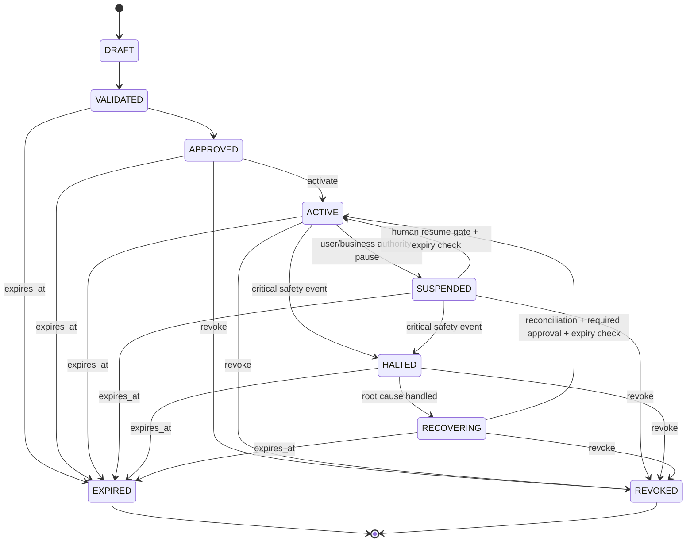
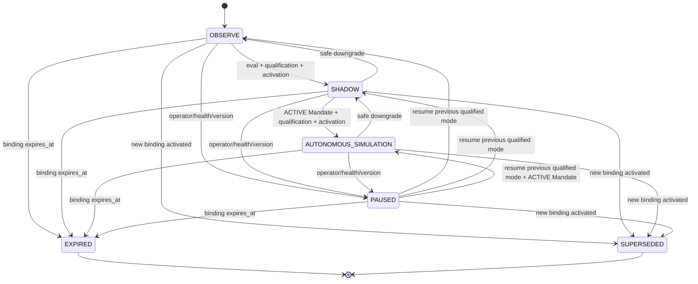
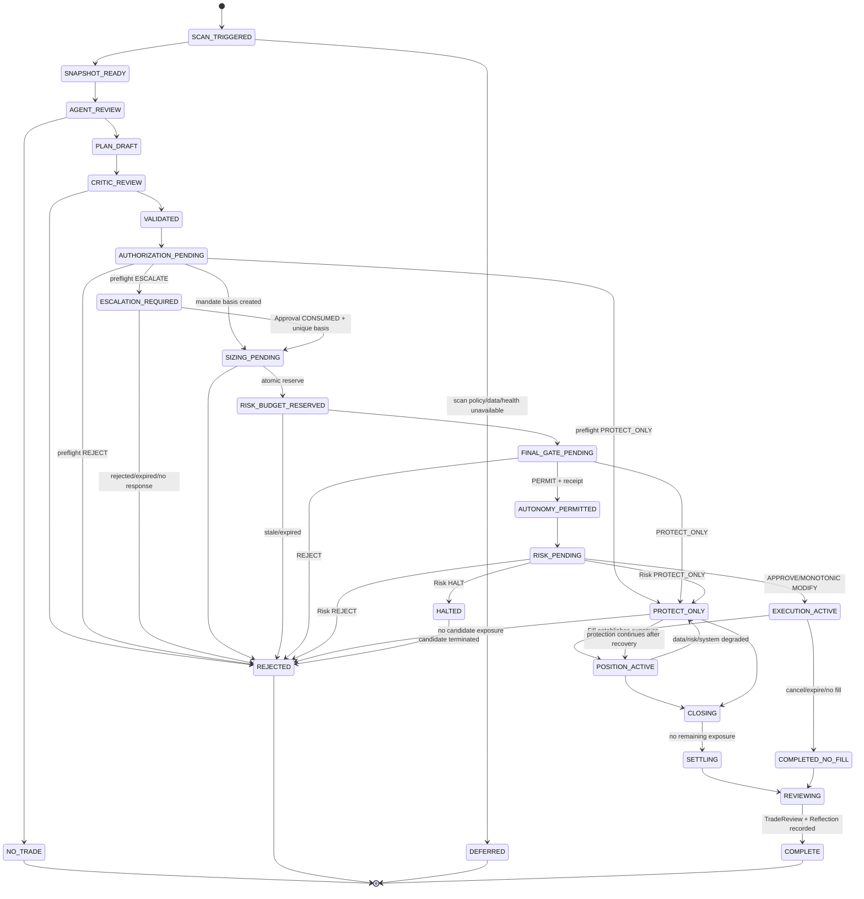
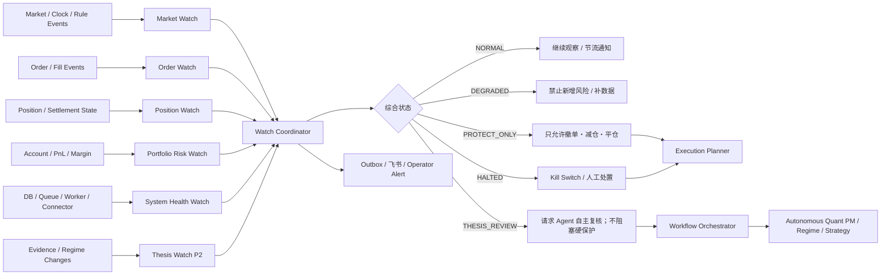
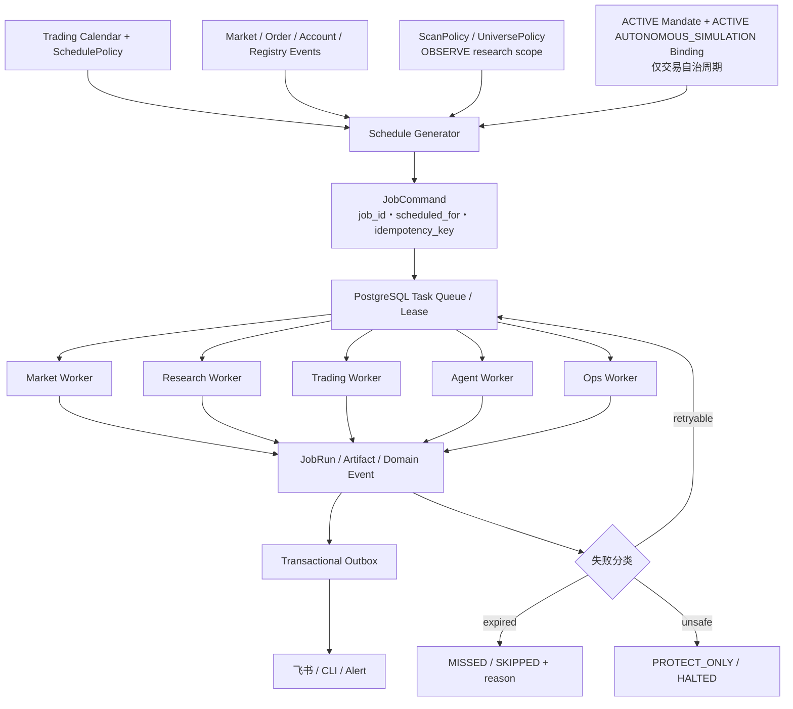
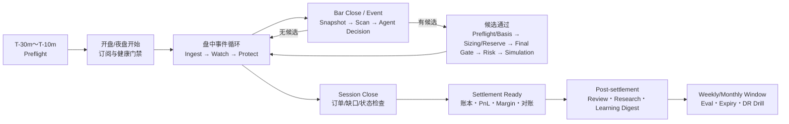

# Futures Agent OS — 系统架构、用户生命周期与盯盘调度设计

文档版本：`2.1-proposed`  
日期：2026-08-18  
范围：研究、回测、模拟交易与纸面验证；不含真实交易  
关联文档：[PRD](./PRD.md) · [技术方案](./TECHNICAL-DESIGN.md) · [Agent 与 Tool](./AGENT-AND-TOOL-DESIGN.md) · [路线图](./ROADMAP.md)

## 1. 阅读方式

本文用几组中文图回答四个问题；只想快速理解“怎么使用”，优先阅读第 3、8、9 节：

1. 系统由哪些平面、进程和数据真值组成？
2. 用户一次性授权后，系统如何无人值守地发现机会、模拟交易、盯盘、退出、复盘并让用户学习？
3. 有持仓时，系统如何持续盯行情、订单、风险、保护和基础设施？
4. 开盘前、盘中、结算后、每日、每周和每月分别运行哪些任务？

所有时间频率都是版本化 `SchedulePolicy`，最终值应按数据源 SLA、交易所时段、品种流动性和容量测试确定。不能用一个固定 cron 代替交易日历和夜盘语义。

## 2. 全系统架构总览

```mermaid
flowchart TB
    subgraph EXT["用户与外部世界"]
      U["用户 / 交易负责人<br/>授权・观察・控制・学习"]
      FS["飞书 Bot<br/>重要通知・升级卡・回放"]
      CLI["CLI / 管理 API"]
      MDS["行情 / 合约规则 / 宏观新闻源"]
      PAPER["可选 Paper / TqSim Connector"]
    end

    subgraph EDGE["交互与接入层"]
      GW["Gateway<br/>鉴权・去重・快速 ACK"]
      INBOX["Inbox<br/>event_id 幂等"]
      OUTBOX["Outbox / Notification Sender"]
    end

    subgraph CONTROL["Agent 控制面"]
      ORCH["Deterministic Workflow Orchestrator<br/>触发・状态・重试・幂等・deadline"]
      MAIN["Autonomous Quant PM Agent<br/>筛选・决策・解释"]
      AGENTS["专业 Agent Workers<br/>Regime・Research・Strategy・Portfolio<br/>Risk・Execution Advisor・Critic<br/>Reviewer・Experiment・Memory・Governance"]
      TG["Tool Gateway<br/>Schema・权限・as_of・预算・审计"]
      REG["Registry & Policy<br/>Agent・Prompt・Model・Tool・Strategy・Risk"]
      CHECKPOINT["Agent Checkpoint<br/>仅编排状态，非业务真值"]
    end

    subgraph AUTH["Decision 自治授权"]
      DA["Decision Authority Application"]
      MANDATE["Simulation Autonomy Mandate<br/>账户・品种・版本・风险・时段・有效期"]
      MODE["AutonomyMode Binding<br/>OBSERVE・SHADOW・AUTONOMOUS_SIMULATION・PAUSED"]
      PREAUTH["AutonomyGate Phase 1<br/>Authorization Preflight"]
      AUTOGATE["AutonomyGate Phase 2<br/>Final Receipt Gate"]
      ESC["Optional PlanApproval<br/>仅允许的例外"]
    end

    subgraph DATA["Point-in-time 数据与市场智能"]
      INGEST["Market Ingest<br/>raw immutable"]
      DQ["Data Quality / Freshness"]
      PIT["Normalized PIT / Feature Store"]
      MSB["Market State Builder<br/>Feature・Regime Model・Term Structure"]
      EVIDENCE["EvidenceBundle / MarketSnapshot"]
    end

    subgraph RESEARCH["研究与实验平面"]
      RS["Research Scheduler / Sandbox"]
      BT["L0–L5 Backtest / Replay"]
      TESTS["Walk-forward・Stress・Scenario<br/>Counterfactual・Sweep・Attribution"]
      EXP["Experiment Registry / Artifacts"]
    end

    subgraph TRADING["确定性模拟交易数据面"]
      PV["TradePlan Validator"]
      SIZE["Portfolio / Position Sizing"]
      RESERVE["Atomic Risk Budget Reservation"]
      RISK["Risk Constitution<br/>唯一 RiskDecision"]
      EXEC["Execution Planner"]
      ORDER["Order State Machine"]
      MATCH["L1–L5 Matching / Fill Model"]
      FILL["Immutable Fill"]
      LEDGER["Accounting / Position / PnL / Margin"]
      SETTLE["Settlement"]
      PROTECT["Position Protection P1–P6<br/>Kill Switch / PROTECT_ONLY"]
    end

    subgraph WATCH["持续盯盘与运行控制"]
      MW["Market Watch<br/>价格・流动性・涨跌停・换月・数据质量"]
      OW["Order Watch<br/>working・partial・cancel/fill race"]
      PW["Position Watch<br/>止损・Trailing・Time Stop・交割"]
      RW["Portfolio Risk Watch<br/>PnL・保证金・集中度・相关性"]
      TW["Thesis Watch<br/>P2 逻辑失效；Agent 可降级"]
      SW["System Health Watch<br/>DB・Queue・Worker・Connector・LLM"]
      WC["Watch Coordinator<br/>NORMAL / DEGRADED / PROTECT_ONLY / HALTED"]
    end

    subgraph SCHED["日历与任务调度"]
      CAL["Trading Calendar Service"]
      SCH["Scheduler / Lease / Retry"]
      PRE["开盘前检查"]
      BAR["Bar-close / Opportunity Scan"]
      EOD["结算・对账・日报・复盘"]
      PERIODIC["周/月评测・过期・灾备演练"]
    end

    subgraph STORE["持久化与可观测性"]
      PG[("PostgreSQL<br/>业务真值・Mandate・授权・治理审批・审计・Outbox")]
      OBJ[("Object Store / Parquet<br/>行情・数据集・实验产物")]
      OBS[("Logs / Metrics / Traces / Alerts")]
      DJ["Decision Journal<br/>追加投影・可重建"]
    end

    U --> FS --> GW
    U --> CLI --> GW
    GW --> INBOX --> ORCH
    GW -->|"Mandate / Mode / composite pause"| DA
    DA --> MANDATE
    DA --> MODE
    ORCH -->|"bounded AgentTask"| MAIN
    MAIN -->|"typed DelegationPlan"| ORCH
    ORCH -->|"fan-out specialist tasks"| AGENTS
    AGENTS -->|"typed artifacts / fan-in"| ORCH
    ORCH -->|"collected evidence"| MAIN
    AGENTS --> TG
    MAIN --> TG
    REG --> ORCH
    REG -->|"qualification / activation facts"| DA
    ORCH <--> CHECKPOINT

    MDS --> INGEST --> DQ --> PIT --> MSB --> EVIDENCE
    PIT --> OBJ
    EVIDENCE --> TG
    TG --> RS
    RS --> BT --> TESTS --> EXP
    EXP --> PG
    EXP --> AGENTS

    TG --> PV --> PREAUTH
    MANDATE --> PREAUTH
    MODE --> PREAUTH
    PREAUTH -->|"AUTHORIZED basis"| SIZE --> RESERVE --> AUTOGATE
    PREAUTH -->|"ESCALATE"| ESC
    PREAUTH -->|"REJECT / PROTECT_ONLY"| MAIN
    MANDATE --> AUTOGATE
    MODE --> AUTOGATE
    AUTOGATE -->|"PERMIT + receipt"| RISK
    ESC --> OUTBOX
    GW --> ESC
    ESC -->|"new AuthorizationBasis"| SIZE
    AUTOGATE -->|"REJECT / PROTECT_ONLY"| MAIN
    RISK -->|"APPROVE / MODIFY"| EXEC --> ORDER --> MATCH --> FILL --> LEDGER
    RISK -->|"REJECT"| MAIN
    RISK -->|"PROTECT_ONLY"| PROTECT
    RISK -->|"HALT"| PROTECT
    LEDGER --> SETTLE
    LEDGER --> PROTECT
    PROTECT --> ORDER
    MATCH <--> PAPER

    INGEST --> MW
    ORDER --> OW
    FILL --> OW
    LEDGER --> PW
    LEDGER --> RW
    EVIDENCE --> TW
    PG --> SW
    MW --> WC
    OW --> WC
    PW --> WC
    RW --> WC
    TW --> WC
    SW --> WC
    WC --> PROTECT
    WC --> OUTBOX
    WC -->|"语义复核/解释"| ORCH

    CAL --> SCH
    SCH --> PRE
    SCH --> BAR
    SCH --> EOD
    SCH --> PERIODIC
    PRE --> INGEST
    PRE --> WC
    BAR --> MSB
    BAR --> ORCH
    EOD --> SETTLE
    EOD --> ORCH
    PERIODIC --> RS
    PERIODIC --> REG

    CONTROL --> DJ
    AUTH --> DJ
    TRADING --> DJ
    DJ --> PG

    OUTBOX --> FS
    CONTROL --> PG
    AUTH --> PG
    TRADING --> PG
    SCHED --> PG
    DATA --> OBS
    CONTROL --> OBS
    RESEARCH --> OBS
    TRADING --> OBS
    WATCH --> OBS
```

### 2.1 图中的硬边界

- Agent 控制面停机时，已有持仓的确定性 Protection、Order、Matching、Accounting 和 Settlement 继续运行。
- Workflow Orchestrator 是确定性运行时；Main 是 `Autonomous Quant PM Agent`，二者不能混为一个依赖 LLM 自维持的循环。
- `Agent Checkpoint` 只保存任务运行位置；Mandate、Gate receipt、风险预算、订单、持仓、账本、风险和治理审批真值只在业务上下文中。
- Thesis Watch 是 P2 逻辑失效辅助，可调用 Agent；P1/P3/P4/P5/P6 不依赖 Agent。
- Scheduler 只能创建带幂等键的命令或任务，不能直接改订单、持仓、账本或 Registry activation。
- 常规 V3 模拟交易无需逐笔审批；每个 Agent 发起的新暴露必须同时具有 ACTIVE Mandate、ACTIVE AUTONOMOUS_SIMULATION Binding、qualified bindings/health、AuthorizationBasis、原子 RiskBudgetReservation、短期 AutonomyGateReceipt 和最新 RiskDecision。
- Watch Coordinator 可以进入 `PROTECT_ONLY/HALTED`。恢复不得复用旧 receipt；短暂 DEGRADED 可按 policy 自动重评，HALTED 必须完成规定的人工恢复门禁。
- 确定性 Risk Watch/Protection 对已有暴露执行 cancel/reduce/close/halt 时使用 ProtectionMandate 和单调降险校验，不伪造新 TradePlan/Receipt/Reservation；任何可能反向或增加暴露的动作必须回到完整新暴露链。
- Mandate、一次性升级和 Risk Constitution 都只能授权模拟环境，任何路径不得产生真实交易订单。

## 3. 用户授权后到交易结束的完整生命周期

```mermaid
sequenceDiagram
    autonumber
    actor User as 用户
    participant GW as 飞书/CLI Gateway
    participant Mandate as Autonomy Mandate
    participant Mode as Autonomy Mode
    participant Scheduler as Scheduler/Market Events
    participant Flow as Workflow Orchestrator
    participant Main as Autonomous Quant PM
    participant Data as Market/Data Tools
    participant Experts as 专业 Agents
    participant Decision as Plan Validator
    participant Preflight as Authorization Preflight
    participant Budget as Sizing/Risk Budget
    participant Gate as Final Receipt Gate
    participant Risk as Risk Constitution
    participant Exec as Execution/Matching
    participant Watch as Watch/Protection
    participant Ledger as Accounting/Settlement
    participant Reviewer as Post-trade Reviewer
    participant Curator as Memory Curator
    participant Experiment as Experiment Manager
    participant Learning as Learning & Review Core
    participant GovAgent as Governance Agent
    participant Gov as Governance Service

    User->>GW: 一次性配置自治委托与运行级别
    GW->>Mandate: 校验账户、品种、策略、版本、时段、风险和通知范围
    GW->>Mode: 以已评测/已激活版本设为 AUTONOMOUS_SIMULATION
    Mandate-->>User: ACTIVE Mandate + 有效期
    Mode-->>User: qualified Mode + 暂停/撤回/Kill 控制入口

    loop 每个交易 Session / EffectiveAutonomy
        Scheduler->>Flow: AUTONOMY-PREFLIGHT / OPPORTUNITY-SCAN / 市场事件
        Flow->>Mandate: 检查 ACTIVE、expiry、scope 和 revocation
        Flow->>Mode: 检查 AUTONOMOUS_SIMULATION、qualification 和 health
        alt Mandate/Mode/health 任一不允许
            Flow-->>User: 节流后的暂停或恢复条件摘要
        else 可以自主评估
            Flow->>Main: 创建 AutonomyCycle / DecisionEpisode 任务
            Main->>Data: 固化 as_of、MarketSnapshot、AccountSnapshot、RuleSet
            Data-->>Main: 真值、freshness、quality、warnings
            Main->>Flow: typed DelegationPlan
            Flow->>Experts: 按依赖有界 fan-out AgentTask
            Experts-->>Flow: typed artifacts
            Flow-->>Main: fan-in 证据、反证、风险与执行建议

            alt 无优势/数据不足/反证成立
                Main->>Flow: NO_TRADE / DEFER + reason codes
                Flow-->>User: 日终聚合主要跳过原因
            else 形成完整 TradePlan
                Main->>Decision: Plan + snapshots + versions
                Decision->>Decision: schema/evidence/ProtectionIntent/version validation
                Decision->>Preflight: Phase 1：解析 AuthorizationBasis
                alt Preflight REJECT / PROTECT_ONLY
                    Preflight-->>Main: 不授权 + reason codes
                    Main-->>User: 仅重要拒绝/风险事件即时通知
                else Preflight ESCALATE
                    Preflight-->>User: 可选 PlanApproval 卡；带 Plan hash 与 expiry；未占预算
                    alt 用户在有效期内批准
                        User->>Preflight: PlanApproval
                        Preflight-->>Decision: 原子 CONSUMED approval + 唯一 PLAN_APPROVAL Basis
                    else 拒绝/未回复/过期
                        Preflight-->>Main: NO_TRADE
                    end
                else Preflight AUTHORIZED
                    Preflight-->>Decision: MANDATE AuthorizationBasis
                end

                opt 存在有效 AuthorizationBasis
                    Decision->>Budget: sizing + atomic RiskBudgetReservation
                    Budget->>Gate: Phase 2：Plan + Basis + Mode + reservation + latest refs
                    alt Final REJECT / PROTECT_ONLY
                        Gate-->>Main: 不签发 Receipt + reason codes
                        Gate->>Budget: 幂等释放 reservation
                        Main-->>User: 仅重要拒绝/风险事件即时通知
                    else Final PERMIT
                        Gate-->>Risk: 单用途 Gate receipt + reservation
                    Risk->>Risk: 使用最新组合状态执行硬风控
                    alt Risk REJECT
                        Risk-->>Main: reason codes
                        Risk->>Budget: 幂等释放 reservation
                        Main-->>User: RISK；不产生 Order
                    else Risk PROTECT_ONLY
                        Risk->>Budget: 释放候选 reservation
                        Risk->>Watch: 禁止新暴露；已有仓位只降险
                        Watch-->>User: RISK + 剩余风险
                    else Risk HALT
                        Risk->>Budget: 释放候选 reservation
                        Risk->>Watch: Kill Switch / cancel / flatten policy
                        Watch-->>User: CRITICAL；系统不等待回复
                    else APPROVE / 只缩小的 MODIFY
                        Risk->>Budget: 消费或收缩 reservation
                        Risk->>Exec: 授权目标 + immutable risk ceiling
                        Risk->>Watch: ProtectionMandate + KillSwitch state
                        Exec->>Exec: ExecutionPlan → Order → zero/many Fill
                        Exec->>Ledger: Fill / fees / margin events
                        Ledger->>Watch: Position / PnL / margin facts
                        Watch-->>User: TRADE 通知：原因、反证、风险、保护、回放

                        loop Position 或 Working Order 存在
                            Data->>Watch: 行情、规则、质量与时钟事件
                            Ledger->>Watch: PnL、margin、exposure、settlement state
                            Watch->>Watch: Market/Order/Position/Portfolio/System checks
                            alt 硬保护或 Kill Switch
                                Watch->>Exec: ProtectionTrigger/RiskBreach/KillSwitch + Position expected version
                                Exec->>Exec: RiskReductionValidation
                                alt VALIDATED
                                    Exec->>Exec: ProtectiveRiskAction → cancel/Order → zero/many Fill
                                    Exec->>Ledger: Fill 或订单状态
                                    Ledger->>Watch: 更新 Position / PnL / margin facts
                                    Watch-->>User: RISK / CRITICAL + 已执行动作 + 剩余风险
                                else REJECTED / STALE
                                    Exec-->>Watch: 零 Action；刷新 Position/保护事实并升级
                                    Watch-->>User: CRITICAL + 未执行原因 + 当前剩余风险
                                end
                            else Thesis 可能失效
                                Watch->>Flow: P2 evaluation request
                                Flow->>Main: 创建持仓再评估任务
                                Main->>Flow: Regime/Strategy DelegationPlan
                                Flow->>Experts: 有界重新评估
                                Experts-->>Flow: HOLD / REDUCE / CLOSE evidence
                                Flow-->>Main: typed results
                                alt HOLD
                                    Main-->>User: 仅重大 Thesis 变化通知；零命令
                                else REDUCE / CLOSE / tighten
                                    Main->>Decision: 创建不可变 RiskReductionRequest
                                    Decision->>Exec: Request + Position ref + expected version
                                    Exec->>Exec: RiskReductionValidation
                                    alt VALIDATED
                                        Exec->>Exec: ProtectiveRiskAction → Order → zero/many Fill
                                        Exec->>Ledger: Fill 或订单状态
                                        Ledger->>Watch: 更新 Position / PnL / margin facts
                                        Main-->>User: Thesis 变化 + 已执行动作 + 剩余风险
                                    else REJECTED / STALE
                                        Exec-->>Main: 零 Action + reason code
                                        Main-->>User: 仅重大未执行/重评事件
                                    end
                                end
                            else 正常
                                Watch->>Watch: 继续确定性保护
                            end
                        end

                        Ledger->>Ledger: 日终盯市、结算与对账
                        Ledger->>Learning: SettlementCompleted / PositionClosed + accounting facts
                        Learning->>Learning: 构建并关闭可重建 TradeEpisode 投影
                        Learning->>Reviewer: TradeEpisodeClosed + attribution inputs
                        Reviewer->>Reviewer: 只生成 TradeReview + Reflection
                        Reviewer-->>Main: 过程质量、结果质量、未验证项
                        Main-->>User: 平仓解释 + 日终学习报告 + Episode 回放
                        opt V4 验证式学习
                            Reviewer->>Curator: Reflection
                            Curator->>Learning: LessonCandidate + 验证需求
                            Learning->>Experiment: 预注册 LessonValidation
                            Experiment->>Learning: ValidationEvidence
                            alt 验证通过
                                Learning->>Learning: 创建 ValidatedLesson
                                Learning->>GovAgent: 请求资格/启用评审
                                GovAgent->>Gov: ActivationProposal
                                Gov->>Gov: 独立治理/人工决定 qualification + Activation
                            else 拒绝或低置信
                                Learning-->>Main: 保留候选与证据，不进入默认知识
                            end
                        end
                    end
                    end
                end
            end
        end
    end

    User->>GW: 随时查看原因、暂停/恢复、收紧风险或请求清仓
    GW->>Mandate: 幂等 composite pause/revoke/resume 的业务授权部分
    GW->>Mode: 同事务 pause/resume 运行级别；保护与结算不停
```

### 3.1 “结束”的四种含义

| 结束类型 | 条件 | 后续 |
|---|---|---|
| 用户交互结束 | 用户已完成授权或查询 | 自主 Session 可继续；交互不是交易循环开关 |
| 研究结束 | Hypothesis 得到 Supported/Partial/Rejected/Stale | 报告归档；候选可进入下一 gate |
| 交易结束 | 无 Working Order、Position 已平、保护已注销 | 等待 Settlement 和 Review |
| 学习闭环结束 | Lesson/Strategy/ChangeProposal 被拒绝、验证或过期 | Registry 保留证据；不自动影响运行版本 |
| 自治委托结束 | Mandate 过期、撤回或永久终止 | 不再新增风险；已有仓位继续保护、退出、结算和复盘 |

交易平仓不是整个生命周期结束：结算、对账、复盘、反事实验证和治理仍会继续。

## 4. 生命周期状态图

自治委托是长生命周期授权，不能与单次交易 Episode 混为一张状态机：

Mandate 的 `SUSPENDED` 只表达业务授权暂停（如 USER_PAUSE/AUTHORITY_SCOPE_DISABLED），只能由用户/授权主体显式恢复。健康降级和策略/Agent/模型/policy 隔离进入 Mode PAUSED 或 Watch Health 降级，不静默改写 Mandate。任何 activate/resume/recover 都先检查 expiry/revocation；`HALTED` 永不静默恢复。

AutonomyMode 是独立运行绑定；V1 只用 OBSERVE，V2 用 SHADOW 和显式 MANUAL_TEST，V3 才允许 Agent 使用 AUTONOMOUS_SIMULATION：

图中的四种运行 Mode 与 Binding 的 EXPIRED/SUPERSEDED 终态分开理解。`EffectiveAutonomy = ACTIVE Mandate ∧ ACTIVE AUTONOMOUS_SIMULATION Binding ∧ qualified bindings ∧ health permits`，优先级为 `HALT/PROTECT_ONLY > Mandate/Mode Binding invalid > Mode PAUSED > authorization chain`。用户“暂停自治”在同一事务把 Mandate 置为 `SUSPENDED(USER_PAUSE)`、Mode 置为 `PAUSED`，同时使未消费 Basis/Receipt stale 并释放 reservation；Binding expiry/supersession 执行同样的失效与释放动作但不改写 Mandate，已有保护继续；恢复必须通过 Mandate、Mode 和 Health 三类门禁。

每个触发创建一个受控 `AutonomyCycle`；它可包含多个 DecisionEpisode，只有进入风险/执行链的 DecisionEpisode 才延伸为 TradeEpisode。下图是 Cycle 编排状态，不取代三个领域对象的独立真值：

AutonomyCycle 在 Reviewer 写入 TradeReview/Reflection 后即可结束。V4 的 LessonCandidate → LessonValidation → ValidatedLesson → Governance Activation 是由这些事实异步派生的独立流程，不属于 V3 Cycle 的必经状态，也不阻塞交易结束。

## 5. 盯盘架构

盯盘不是一个大循环，也不是 Main Agent 每分钟“看一下”。它由五个确定性 watcher、一个可降级的语义 watcher 和一个协调器组成。

P2 分两层：V2 把 Strategy Spec 中显式、可重放的 Thesis 失效谓词交给确定性 Position Watch；V3 才启用下图中的 Agent Thesis Watch 做语义复核。语义层离线不会关闭 V2 的确定性 P2，也不能延迟任何硬保护。

### 5.1 Watcher 职责

| Watcher | 主要输入 | 检查 | 允许动作 |
|---|---|---|---|
| Market Watch | tick/bar、bid/ask、rule、clock | freshness、缺口、乱序、涨跌停、流动性、换月 | 标质量、阻止开仓、触发降级或新的机会扫描 |
| Order Watch | Order/Fill/connector | working 超时、partial、拒绝、撤单/成交竞态、状态未知 | 查询、撤未成交、升级人工对账 |
| Position Watch | Position、StopPolicy、calendar | P1、P3、P4、交割、保护覆盖数量 | 收紧保护、减仓、平仓 |
| Portfolio Risk Watch | account、PnL、margin、exposure | P5、日损、保证金缓冲、集中度、相关性突升 | PROTECT_ONLY、组合降险、P6 |
| Thesis Watch | evidence、MarketStateAssessment | P2 逻辑失效、Regime 变化、原假设反证 | 请求 Agent 输出 HOLD/REDUCE/CLOSE；降险可自动执行，不能放宽硬保护或增加暴露 |
| System Health Watch | DB、queue、worker、storage、connector、LLM | 延迟、backlog、lease、错误率、依赖不可用 | 降级、熔断、halt、告警 |

### 5.2 监控状态与恢复

| 状态 | 新增风险 | 已有仓位 | 通知 | 恢复要求 |
|---|---|---|---|---|
| NORMAL | EffectiveAutonomy + 新 Gate/Risk 后可新增 | 全部保护运行 | 重要事件/节流摘要 | 无 |
| DEGRADED | 默认阻止或更保守 | 保护继续 | RISK | 健康稳定窗口 + Mode resume policy + 新 Gate |
| PROTECT_ONLY | 禁止 | 仅撤单、减仓、平仓 | RISK | 对账、健康、Risk Admin gate |
| HALTED | 禁止 | 按 Kill Switch policy | CRITICAL | 根因处理、对账、人工批准 |
| RECOVERING | 禁止 | 保护和状态重建 | ACTION_REQUIRED | replay、账本平衡、connector reconciliation |

从任何故障恢复后都不能复用旧 Gate receipt。短暂 `DEGRADED` 可在健康稳定窗口、Mode resume policy 和所需 Mandate 均满足时自动恢复至 previous_mode，但每笔新 Plan 仍重新检查 expiry、hash、Mode、市场/账户/规则、原子风险预算、AutonomyGate 和 Risk Constitution。`PROTECT_ONLY/HALTED` 按故障等级完成对账及 Risk Admin/人工恢复门禁。

## 6. 调度与定时任务架构

### 6.1 调度原则

- 交易时段任务由 `TradingCalendar + ContractRuleVersion` 生成，不使用“每天 9:00”这种永久硬编码。
- V1 `OBSERVE` 研究扫描由版本化 ScanPolicy/UniversePolicy 和可选 research-scope Mode 触发，不需 Mandate 且不能创建 TradePlan；只有可能提交新暴露的 V3 交易决策周期必须先证明 EffectiveAutonomy。scheduler 只能创建 AutonomyCycle/DecisionEpisode，不能直接创建 Order 或绕过 AutonomyGate。
- 行情、订单、成交和账户风险优先事件驱动；heartbeat 只用于发现漏事件或依赖失联。
- 研究扫描使用 `idempotency_key = scan_policy_version + universe_policy_version + mode_binding_or_none + scope + trading_date + scheduled_for`；交易自治周期再加 `mandate_version + autonomy_mode_binding_version`。事件型候选再加 candidate fingerprint，避免重复行情触发反复开仓。
- scheduler 只创建命令，worker 使用 lease；崩溃后允许重领，但业务副作用仍由 command 幂等保护。
- missed run 不一律补跑：结算必须追补，旧机会扫描通常跳过，保护检查必须立即以最新状态运行。
- 研究任务使用独立资源池和预算，不能抢占 protection、settlement、gateway 或 outbox 的保留资源。
- 任务变更通过版本化 SchedulePolicy 发布；高风险任务需要 activation approval。

## 7. 定时任务目录

下表给出逻辑频率，不提前写死秒数。V0/V1 压测和数据 SLA 确认后，才为每个环境发布具体 policy。

| Job ID | 逻辑触发 | 任务 | 执行者 | Missed-run 策略 |
|---|---|---|---|---|
| `MKT-INGEST` | 数据源事件/轮询 SLA | 拉取、去重、写 raw、发布 PIT 数据 | market-ingest | 可追补；保留迟到标记 |
| `MKT-HEALTH` | source heartbeat | freshness、缺口、乱序、source fallback | Market Watch | 立即以最新状态运行 |
| `SESSION-PREFLIGHT` | 每交易 session 前 | 日历、规则、合约、权限、数据、订阅和连接检查 | scheduler + market/trading worker | 过时则跳过，阻止该 session 新开仓 |
| `RESEARCH-SCAN-PREFLIGHT` | 扫描窗口前 + ScanPolicy/UniversePolicy 变化 | OBSERVE scope、数据、运行版本与研究预算；不要求 Mandate | scheduler + research worker | 未通过则跳过该扫描，不生成交易 |
| `AUTONOMY-PREFLIGHT` | 每 session 前 + Mandate/Mode/Registry 变化 | EffectiveAutonomy、策略/Agent/模型资格、通知健康和当日预算 | scheduler + decision worker | 未通过则 Mode PAUSED/跳过新 DecisionEpisode，不改写 Mandate |
| `MANDATE-EXPIRY` | effective/expiry 边界 + heartbeat | 激活窗口、到期、撤回和续期提醒 | decision/governance worker | 必须补跑；过期后禁止新增风险 |
| `MODE-BINDING-EXPIRY` | Mode effective/expiry/supersession 边界 + heartbeat | 终止旧 Binding、使 Basis/Receipt stale、释放 reservation；已有保护继续 | decision worker | 必须补跑；失效后禁止 Agent 新增风险 |
| `RULE-REFRESH` | 开盘前 + 来源变化事件 | 保证金、费率、涨跌停、交易时段、交割状态 | market-ingest | 必须追补；未完成 fail closed |
| `ROLLOVER-WATCH` | 每日开盘前 + 临近窗口 | 主力变化、连续序列、持仓换月与交割风险 | Market/Position Watch | 立即补跑并升级告警 |
| `BAR-SNAPSHOT` | 每个配置周期 bar close | 冻结 snapshot、特征、Market State | market worker | 旧 bar 可补数据；过时信号不补发 |
| `OPPORTUNITY-SCAN` | bar close / session milestone | 确定性筛选，只有高价值候选调用 Agent | scheduler + agent worker | 通常跳过旧扫描 |
| `AUTONOMOUS-DECISION` | 候选升级/关键市场事件 | 创建 Episode，运行 Quant PM 与专家图，生成 TRADE/NO_TRADE/DEFER | workflow + agent worker | 过期候选跳过；不回补交易 |
| `DECISION-DEADLINE` | Plan/Episode deadline | 取消陈旧任务、释放 reservation、关闭升级请求 | workflow worker | 必须运行；幂等清理 |
| `RISK-BUDGET-RECONCILE` | Plan/Order/Fill/PnL/expiry 事件 + heartbeat | 原子 reservation 的持有、消费、释放与组合预算重算 | trading worker | 不得跳过；冲突时禁止新增风险 |
| `ORDER-RECONCILE` | Order/Fill 事件 + heartbeat | working/partial/unknown 状态对账 | trading worker | 立即追补，必要时 PROTECT_ONLY |
| `PROTECTION-EVAL` | 每次市场/持仓/规则事件 | P1/P3/P4/P5/P6 检查 | trading worker | 不得跳过；用最新状态立即运行 |
| `THESIS-EVAL` | 关键证据/Regime 变化 + 低频巡检 | P2 逻辑失效评估 | agent worker | 可降级；不影响硬保护 |
| `PORTFOLIO-RISK` | Fill/PnL/margin/price 变化 + heartbeat | 风险预算、集中度、相关性、日损 | trading worker | 不得跳过；立即最新计算 |
| `SESSION-CLOSE` | 每 session 结束 | 撤销/保留订单检查、缺口、盘后快照 | trading worker | 必须追补 |
| `DAILY-SETTLEMENT` | 结算数据就绪 | 盯市、费用、保证金、账本、对账 | accounting worker | 必须按 trading_date 顺序追补 |
| `DAILY-REVIEW` | settlement 成功后 | Episode 归因、Reviewer、待验证问题 | agent/research worker | 可延迟，不可先于结算 |
| `DAILY-AUTONOMY-DIGEST` | settlement/review 后 | 扫描、交易、跳过原因、风险、退出和学习视图 | workflow + outbox worker | 可延迟但不得丢失；按 trading_date 聚合 |
| `DAILY-RESEARCH` | 日结后资源窗口 | Hypothesis funnel、实验队列和失败汇总 | research worker | 可延迟/取消，禁止抢占交易资源 |
| `LESSON-EXPIRY` | 每日/Registry 事件 | Lesson 到期、冲突、复验请求 | learning worker | 下次启动补跑 |
| `WEEKLY-PORTFOLIO` | 每周最后结算后 | 策略/品种/Regime/成本/风险归因 | research worker | 可延迟，绑定完整周数据 |
| `WEEKLY-EVAL` | 每周 + activation 前 | Agent/Prompt/Tool/Model 评测与退化检查 | governance worker | activation 前必须完成 |
| `STRATEGY-HEALTH` | 每日轻量 + 每周完整 | 漂移、连续退化、成本与 Regime 适配；必要时隔离版本 | research/governance worker | 可延迟；隔离事件立即生效 |
| `NOTIFICATION-DELIVERY-WATCH` | Outbox 事件 + heartbeat | TRADE/ACTION_REQUIRED/RISK/CRITICAL 投递 SLA、备用通道和不可达阈值 | ops/outbox worker | 立即补跑；超阈值按 policy 将 Mode PAUSED，不改写 Mandate |
| `MONTHLY-DATA-AUDIT` | 每月 | 数据许可、覆盖、修订、存储和成本 | ops/data worker | 必须在治理窗口完成 |
| `MONTHLY-DR-DRILL` | 每月/季度 policy | 备份恢复、PITR、Kill Switch、runbook 演练 | operator | 未完成产生 ACTION_REQUIRED |

## 8. 一个交易日的逻辑时间线

中国期货夜盘的自然日与 `trading_date` 可能不同。所有 preflight、session close、settlement 和日报都必须按交易所日历归属，不能按服务器午夜切日。

## 9. 通知与用户介入

| 等级 | 典型事件 | 系统是否等待用户 | 建议确认/介入 | 节流规则 |
|---|---|---|---|---|
| INFO | preflight、研究完成、NO_TRADE/DEFER 聚合、日报 | 否 | 否 | 可聚合、静默时段 |
| TRADE | 开仓、加减仓、平仓、保护变化 | 否 | 通常不需要 | 每个重要状态一次；附原因、风险、保护和回放 |
| ACTION_REQUIRED | Mandate 到期/变更、允许的单次越界升级、严重恢复 | 仅等待该例外/治理对象；超时 fail closed | 是 | 带 expiry、对象 hash 和一次性 nonce；不阻塞已有仓位保护或其他自治周期 |
| RISK | 部分成交、保护未完全退出、保证金恶化 | 否；系统先按 policy 降险 | 建议尽快确认 | 不因普通静默时段丢弃 |
| CRITICAL | Kill Switch、账本不平、connector 状态未知、无保护暴露 | 否；系统立即 halt/protect | 立即介入 | 多通道升级、持续到确认 |

用户的正常角色是观察和学习，而不是逐笔操作。开仓通知解释触发、正反证据、风险预算、止损和退出计划；平仓通知解释原因、成本、PnL 与计划偏差；日终 Digest 汇总扫描数量、交易/跳过原因、过程与结果质量以及仍未验证的经验。普通候选不逐条轰炸用户，但所有 Episode 可查询和回放。

用户可随时执行 `查看原因/回放/暂停自治/恢复自治/收紧 Mandate/请求清仓/Kill Switch`。暂停或撤回只阻止新增风险，已有仓位的保护、退出、结算和复盘继续。卡片更新不能覆盖审计事实；每次按钮动作绑定对象版本。重复点击、旧卡片和过期 nonce 不产生副作用。

## 10. 典型故障下的生命周期

| 故障 | 用户旅程 | 盯盘/定时任务 | 系统状态 |
|---|---|---|---|
| LLM 不可用 | 不生成新 Agent Plan、不新增 Agent 发起暴露 | P1/P3/P4/P5/P6、减风险动作、订单和结算继续 | DEGRADED |
| 单个 Agent 超时 | 当前候选 DEFER，后续扫描继续 | 无影响 | NORMAL/DEGRADED |
| Mandate 过期/暂停/撤回 | 不再创建新风险；升级请求不延长权限 | 保护、减仓、平仓、结算和复盘继续 | SUSPENDED/EXPIRED |
| 飞书不可用 | CLI/备用告警；授权内模拟按通知健康 policy 继续，关键不可达超阈值后暂停新增 | watcher、outbox 持久重试继续 | NORMAL/DEGRADED |
| 行情陈旧 | Plan DEFER，禁止新增风险 | 使用 staleness policy，只减仓/保护 | PROTECT_ONLY |
| RuleSet 缺失 | 新交易拒绝 | 临近交割/已有仓位升级人工 | PROTECT_ONLY |
| PostgreSQL 主库故障 | 不接受新业务命令 | 进入 halt；恢复后 replay/对账 | HALTED/RECOVERING |
| Research worker 满载 | 研究排队或取消 | 不影响交易 worker 和 protection | NORMAL/DEGRADED |
| RiskBudgetReservation 冲突/卡死 | 拒绝或串行重算，不能超卖预算 | 无影响 | DEGRADED |
| Agent/Model/Prompt 版本被隔离 | 取消其未授权候选，使用已批准 fallback 或停止 | 已有仓位只走确定性保护 | DEGRADED/PROTECT_ONLY |
| Paper connector UNKNOWN | 不假设成交或撤单 | reconcile、冻结新增风险 | PROTECT_ONLY |
| 账本不平 | 用户收到 CRITICAL 通知（incident severity=P0） | 停止非保护写入、对账 | HALTED |

## 11. 各版本落地范围

| 版本 | 图中启用范围 |
|---|---|
| V0 | Gateway/进程骨架、PostgreSQL、Scheduler、Registry、Mandate/Mode/Basis/Gate/reservation/DecisionJournal schema、artifact/tool schema、synthetic health checks |
| V1 | PIT 数据、Market State、OBSERVE 研究调度、Main/Regime/Research/Critic/Experiment 链和 DecisionJournal 基础；无 TradePlan/交易副作用 |
| V2 | SHADOW TradePlan、MANUAL_TEST PlanApproval、Sizing、RiskBudgetReservation、最小两阶段 AutonomyGate/Receipt、Risk、Order、Matching、Ledger、Settlement、P1–P6 Watch（P2 为确定性 Strategy Spec 谓词）；CLI 显式模拟 |
| V3 | Autonomous Quant PM、Strategy/Portfolio/Risk/Execution Advisor、主动扫描、自治 Mandate/Mode、基础资格与 Activation、可选 PlanApproval、Agent P2 Thesis Watch 语义扩展、Reviewer 和完整无人值守黄金旅程 |
| V4 | L2 规模化实验、Memory、Governance Agent、Lesson expiry、周度评测和高级策略晋升 |
| V5 | L3/L4/L5、高级执行/组合、HA/DR、正式容量和 30 天稳定运行 |

## 12. 架构验收场景

1. 用户离线时，系统在 EffectiveAutonomy 内完成 scan → decide → preflight/basis → reserve/final gate → risk → simulate → watch → close → review → digest。
2. 同一个 schedule/market 事件重复投递，只创建一个 AutonomyCycle、每个候选至多一个 DecisionEpisode，且最多一个有效副作用命令。
3. Gate receipt 产生后、提交前价格或账户显著变化，Plan 变 stale，释放 reservation 并重新运行 Gate/Risk，不复用许可。
4. 两个并发计划单独均在上限内、合计超限时，原子 RiskBudgetReservation 只允许安全组合进入执行。
5. Plan 超出品种、策略、时段、次数或风险 Mandate 时，Authorization Preflight 只会 `ESCALATE/REJECT/PROTECT_ONLY`；无人回复不会占用 reservation 或产生 Order。
6. Agent 不能创建、扩大、续期或激活自己的 Mandate，单次升级和普通用户都不能覆盖硬风险拒绝。
7. Agent worker 在持仓期间全部停机，硬止损、组合止损、Kill Switch 和结算继续。
8. Thesis 失效时 REDUCE/CLOSE 可自动降险，但 Agent 不能自动扩大仓位或放宽止损。
9. 止损触发但无对手盘，Order 保持未成交/部分状态并持续告警，不伪造 Fill。
10. 日结任务崩溃后按 trading_date 幂等追补，不重复手续费或 PnL。
11. 夜盘跨自然日，所有 snapshot、保护和 settlement 使用正确 trading_date。
12. missed opportunity scan 不回头补发过期交易机会；missed protection/settlement 必须追补。
13. 行情源陈旧时系统进入 PROTECT_ONLY/Mode PAUSED；恢复后旧 receipt 失效，短暂 DEGRADED 仅可按 Mode/health policy 自动重评，不改写 Mandate。
14. Mandate 过期或用户暂停后不再新增风险，已有仓位继续保护、退出、结算和复盘。
15. 飞书不可用时通知进入 Outbox 并按 policy 继续或暂停新增风险，不把消息未送达解释为批准。
16. Post-trade Reflection 不出现在默认决策记忆中，直到实验验证与治理通过。
17. 用户可从最终 Review 追溯 schedule/event、Mandate、所有 Agent、Tool、Gate receipt、reservation、可选升级、RiskDecision、Order、Fill、Ledger 和 SchedulePolicy。
18. 用户收到的开仓、平仓和日终 Digest 足以回答“为什么交易、为什么退出、为什么跳过、Agent 学到了什么”，且不泄露隐藏推理。

## 13. 需要在 V0/V1 确认的参数

- 每个行情源的 freshness/heartbeat SLA。
- 各品种、周期和 session 的 bar-close 与 scan policy。
- Watch Coordinator 从 DEGRADED 升级到 PROTECT_ONLY/HALTED 的阈值。
- 订单/connector reconcile heartbeat 与超时。
- 日结数据就绪判定和交易所差异。
- INFO/TRADE/ACTION_REQUIRED/RISK/CRITICAL 的通知聚合、送达和升级时间。
- TRADE 通知、日终 Digest 和“为什么未交易”聚合粒度。
- Mandate 的默认有效期、最大交易次数、cooldown、并发 Episode/Position 与 escalation_mode。
- DEGRADED 自动恢复稳定窗口，以及哪些 HALT 必须人工恢复。
- 日/周/月研究预算与交易资源保留比例。
- missed-run 的最大回看窗口和任务优先级。
- sim-prod RPO/RTO、备份和灾备演练频率。

这些参数必须作为版本化 policy 管理，并用合成故障、历史重放和容量测试确认；不得只写在 Prompt 或个人机器 cron 中。
