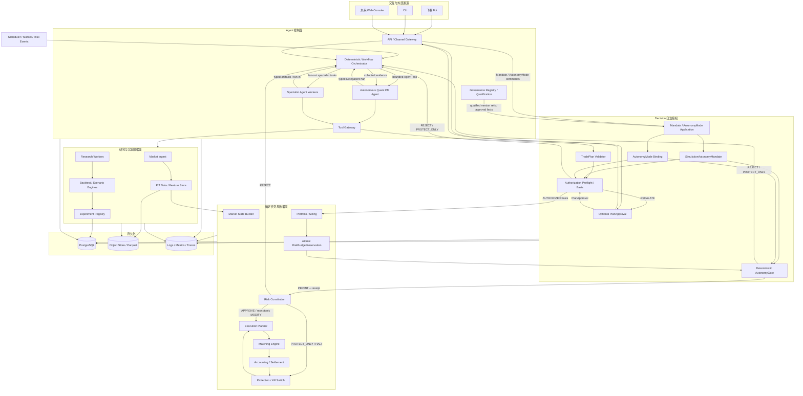
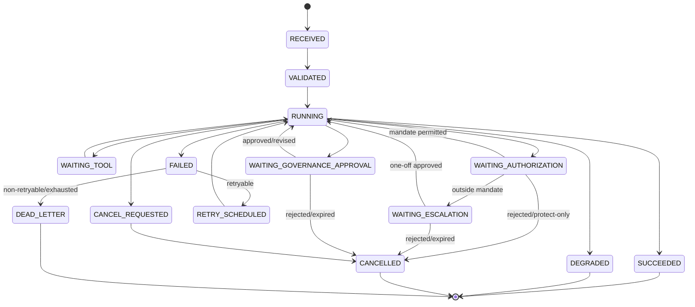
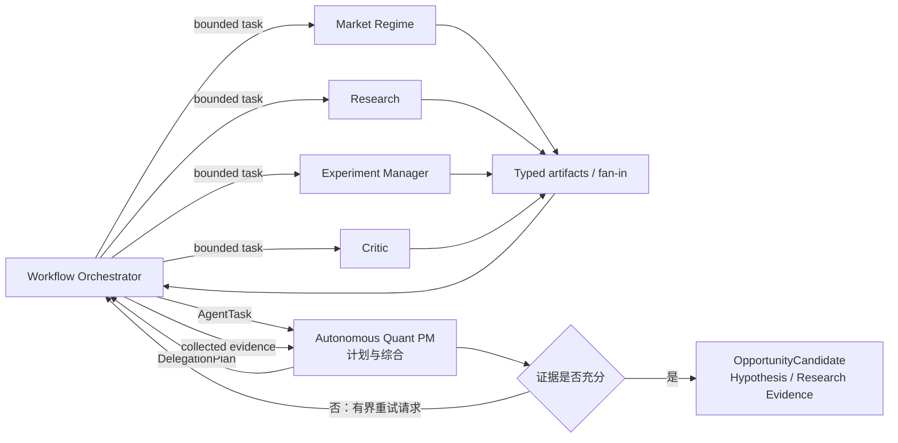
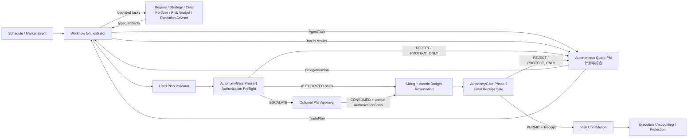
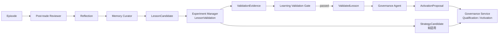
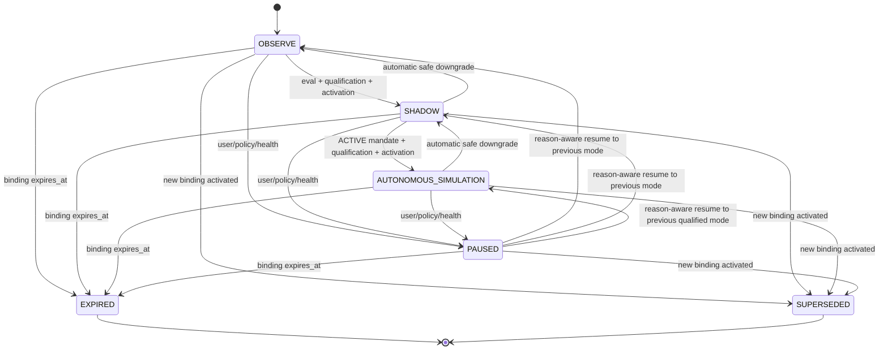
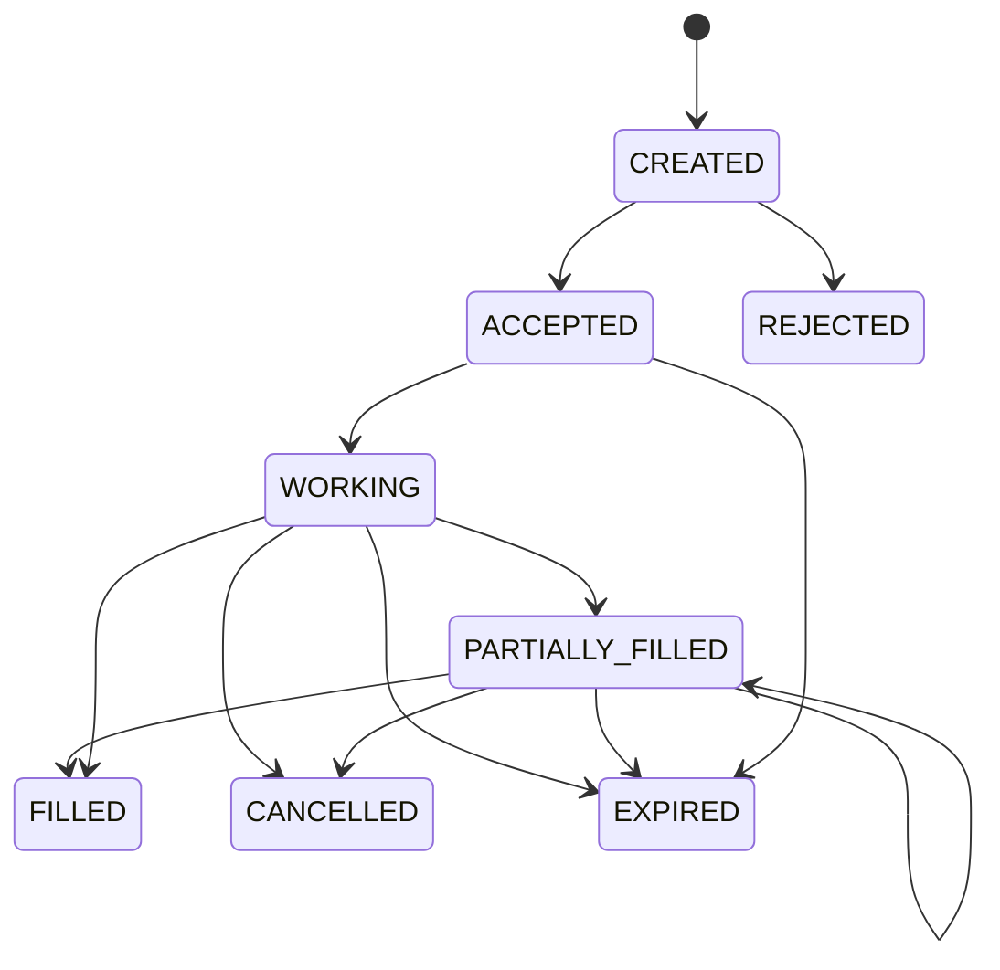
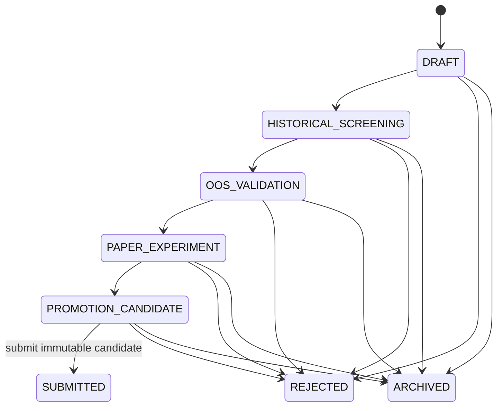
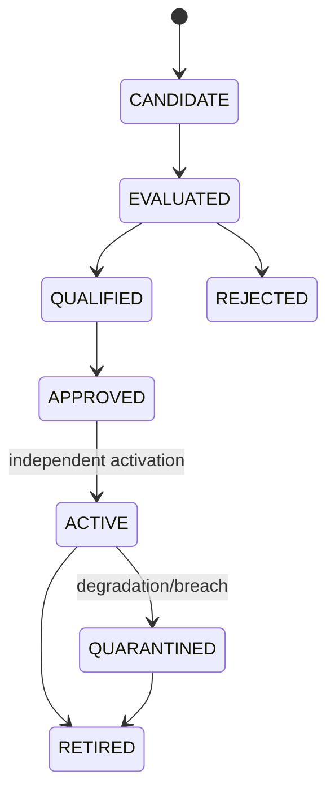

# Futures Agent OS — 技术方案

文档版本：`2.1-proposed`  
日期：2026-08-18  
项目性质：Greenfield，全新独立项目  
适用范围：研究、回测、模拟交易与纸面验证；不含真实交易  
关联文档：[PRD](./PRD.md) · [多 Agent 与工具体系](./AGENT-AND-TOOL-DESIGN.md) · [系统架构与生命周期](./SYSTEM-ARCHITECTURE-AND-LIFECYCLE.md) · [上下文地图](./CONTEXT-MAP.md) · [路线图](./ROADMAP.md)

## 0. 结论先行

本项目采用“多 Agent 决策控制面 + 确定性交易数据面 + point-in-time 研究数据面”的架构。它是一个独立的新系统，不以现有 `futures_workflow` 为代码基座，不继承旧数据库、订单、持仓或账户状态，也不要求旧系统先完成任何迁移。

关键技术决策：

1. 新建独立仓库、独立 Python 包、独立数据库和部署单元；运行时对旧项目零依赖。
2. 源码先采用模块化单体，按故障与安全边界拆成多个进程，而不是首日微服务化。
3. PostgreSQL 从第一个持久化版本启用，承载业务真值、任务、审批、注册表、inbox/outbox 和审计索引。
4. 原始行情、规范化 point-in-time 数据、特征、数据集和大体积实验产物存入对象存储/Parquet，并由不可变 manifest 定址。
5. Agent 只产生版本化提案和解释；风险许可、订单、成交、持仓、账本、保证金、结算和保护由确定性内核负责。
6. Agent 之间不自由聊天，只交换带 schema、证据引用和因果关系的 artifact；并发、循环、预算、超时、取消和冲突均由编排器控制。
7. 研究、回测、模拟和纸面验证共享 Strategy Spec、Instrument/Rule/Calendar 和执行语义；只有数据源与撮合精度不同。
8. 所有副作用采用显式应用命令、幂等键、事务 outbox 与单逻辑写者；模型输出本身不产生交易事实。
9. Reflection 只能成为候选经验；只有经过样本外/前向实验和治理批准的 `ValidatedLesson` 才可进入默认检索。
10. V0 定义全部目标契约，但按 V1–V5 逐步启用能力；“逻辑角色完整”不等于所有 Agent 常驻运行。
11. V3 起由 `Autonomous Quant PM Agent` 在 EffectiveAutonomy 成立时主动寻找并执行模拟交易；常规计划不逐笔审批，但必须经过两阶段 AutonomyGate，获得有效 AuthorizationBasis、RiskBudgetReservation、单用途 `AutonomyGateReceipt`，并再次通过 Risk Constitution。

## 1. 架构目标与质量属性

### 1.1 首要目标

- 确定性：同一输入、规则版本、时钟和随机种子产生相同交易事实。
- 可审计：任一机会、计划、自治许可、订单、成交、盈亏或经验均可追溯到输入、工具、代码、模型、Mandate 和治理审批版本。
- 安全失败：数据陈旧、规则缺失、模型不可用或状态冲突时默认 `DEFER/REJECT/PROTECT`。
- 可验证：Agent、策略、模型、Prompt、工具和风险规则均有离线评测与启用门槛。
- 可演进：先交付独立且正确的模块化系统，再以实际吞吐和故障隔离需求决定是否拆服务。
- 可接续：任务、版本、证据和验收状态写入仓库与数据库，不依赖单次对话上下文。

### 1.2 非目标

- 不为真实交易所或经纪商发单。
- 不允许 LLM 直接执行 SQL 或写入交易核心表。
- 不把向量库当行情、账户、持仓、风险或审批真值。
- 不以多 Agent 投票替代确定性 AutonomyGate、Risk Constitution 或应有的治理审批。
- 不在首版引入 Kafka、Kubernetes、在线强化学习或自研时序数据库。
- 不承诺将旧项目历史状态无损转成新系统权威状态。

### 1.3 架构不变量

| 编号 | 不变量 | 强制位置 |
|---|---|---|
| INV-001 | `TradePlan != Order` | 类型系统、应用服务、数据库外键 |
| INV-002 | `Risk Analyst Agent != Risk Engine` | 权限、进程、工具白名单 |
| INV-003 | `Order != Fill != Position` | 独立聚合、状态机、账本 |
| INV-004 | 无完整保护策略不得建立新暴露 | TradePlan 校验器 + Risk Constitution |
| INV-005 | 已批准风险上限只可收紧 | 风险版本比较器 |
| INV-006 | 交易数字真值必须来自工具结果 | artifact schema + provenance validator |
| INV-007 | Agent 不直接写核心业务表 | 网络隔离 + DB 凭证 + Tool Gateway |
| INV-008 | 未验证反思不得进入默认记忆 | Registry 状态机 + 检索过滤 |
| INV-009 | 重放不得重复副作用 | command idempotency + inbox/outbox |
| INV-010 | 历史计算只能看到 `as_of` 时点可知信息 | PIT 查询层 + lineage |
| INV-011 | Agent 不能授予或扩大自己的交易权限 | 不可变 Mandate + RBAC + AutonomyGate |
| INV-012 | 并发计划不能分别合规、合计越过组合预算 | 原子 RiskBudgetReservation + 单逻辑交易写者 |
| INV-013 | 任何建立或增加暴露的命令均要求 `AuthorizationBasis != AutonomyGateReceipt != RiskDecision`，三者缺一不可 | 独立 schema、外键与提交校验；单调降险另走 ProtectionMandate/T4-SAFE |

## 2. 总体架构



### 2.1 三个平面

控制面负责从日历、市场、风险和用户事件启动任务，理解意图、分解任务、调用工具、组合专业判断、解析自治委托、仅在越界时请求可选升级，并向用户解释。确定性 Workflow Orchestrator 管状态与重试，Autonomous Quant PM Agent 管交易决策；控制面可以停止工作，但不能破坏交易事实的完整性。

交易数据面负责一切必须精确、可重放和强制执行的内容。即使所有 LLM 离线，已有仓位的条件单、止损、风险降级、结算和 Kill Switch 仍继续运行。

研究数据面负责 PIT 数据集、特征、回测、压力、反事实、参数扫描和产物管理。研究任务可以重算和失败，不得阻塞仓位保护。

### 2.2 源码形态与运行形态

源码采用一个独立 monorepo 中的模块化单体，以共享类型和本地事务降低早期复杂度；运行时至少分为：

| 进程 | 职责 | 能否持有交易写凭证 |
|---|---|---:|
| `gateway` | 飞书/CLI/API、鉴权、inbox、快速 ACK | 否 |
| `agent-worker` | Autonomous Quant PM 与专家 Agent 图执行、checkpoint、模型调用 | 否 |
| `research-worker` | 回测、扫描、压力、报告 | 否 |
| `trading-worker` | 风险、订单、撮合、账本、保护 | 是，限核心 schema |
| `market-ingest` | 行情/规则采集、质量检查、manifest | 限数据 schema |
| `scheduler` | 日历任务、机会扫描、自治 preflight、结算、实验和过期检查 | 通过命令端口 |
| `outbox-sender` | 通知和外部消息投递 | 否 |

进程之间首期通过 PostgreSQL command/task 表、事务 outbox 和受控 HTTP/RPC 接口协作。只有满足以下任一条件才评估 NATS/Kafka：持续事件吞吐超过 PG 队列容量测试阈值、需要独立跨主机广播、消费者数量显著增长，或故障隔离要求无法由现结构满足。

## 3. 仓库与模块边界

建议根包名使用 `futures_agent_os`，避免与 donor 项目混淆：

```text
futures-agent-os/
├── pyproject.toml
├── apps/
│   ├── gateway/
│   ├── agent_worker/
│   ├── research_worker/
│   ├── trading_worker/
│   ├── market_ingest/
│   ├── scheduler/
│   └── outbox_sender/
├── src/futures_agent_os/
│   ├── reference_market_data/
│   ├── market_intelligence/
│   ├── research_experiment/
│   ├── decision/
│   ├── portfolio_risk/
│   ├── execution_simulation/
│   ├── accounting_settlement/
│   ├── learning_review/
│   ├── governance_registry/
│   ├── agent_orchestration/
│   ├── shared_kernel/
│   └── adapters/
├── schemas/
│   ├── artifacts/
│   ├── tools/
│   ├── events/
│   └── api/
├── migrations/
├── tests/
│   ├── unit/
│   ├── contract/
│   ├── integration/
│   ├── replay/
│   ├── fault/
│   └── agent_eval/
├── datasets/
│   ├── synthetic/
│   └── manifests/
├── deploy/
├── docs/
└── scripts/
```

### 3.1 依赖规则

- 领域模块不能依赖 adapters、LLM SDK、飞书 SDK 或数据库 ORM 实现。
- `agent_orchestration` 依赖 artifact/tool port，不依赖交易聚合内部对象。
- `execution_simulation` 不能反向依赖 Agent。
- `portfolio_risk` 可读取账户投影，但只有 `trading-worker` 可提交风险裁决事务。
- `accounting_settlement` 从 Fill、cash event 和 settlement rule 计算，不从 Agent 文本计算。
- shared kernel 只放 Decimal、时间、ID、版本、结果类型等真正稳定概念，禁止成为杂物箱。
- donor 项目不得出现在生产依赖、容器镜像、PYTHONPATH 或数据库连接配置中。

## 4. 领域上下文

详细语言与关系见 [CONTEXT-MAP.md](./CONTEXT-MAP.md)。技术上划分九个核心/通用子域和一个 supporting context：

| 上下文 | 所有权 | 主要输出 |
|---|---|---|
| Reference & Market Data | 合约、规则、交易日历、PIT 行情 | `MarketSnapshotRef`、`RuleSetRef` |
| Market Intelligence | 特征、期限结构、Regime、事件证据 | `MarketStateAssessment` |
| Research & Experiment | 假设、Strategy Candidate、数据集、实验、稳健性 | `StrategyCandidate`、`ExperimentResult` |
| Decision | TradePlan、RiskReductionRequest、SimulationAutonomyMandate、AutonomyGate、升级意图 | `TradePlan`、`RiskReductionRequest`、`AutonomyGateReceipt` |
| Portfolio & Risk | 组合提案、仓位计算、原子风险预算预留、硬风险裁决 | `RiskBudgetReservation`、`RiskDecision` |
| Execution Simulation | RiskReductionValidation、ProtectiveRiskAction、订单计划、Order、Fill、撮合 | `ProtectiveRiskAction`、`Fill` |
| Accounting & Settlement | Position、cash、PnL、margin、结算 | `AccountSnapshot` |
| Learning & Review | DecisionJournal/TradeEpisode 投影、复盘、归因、候选经验 | `TradeEpisode`、`LessonCandidate` |
| Governance & Registry | 策略/模型/Prompt/工具/经验版本与启用 | `ActivationDecision` |
| Agent Orchestration | 触发、任务、图、预算、deadline、checkpoint 与升级编排 | `AgentRun` |

跨上下文不共享可变 ORM entity；通过版本化 schema、事件和显式查询模型交换。

## 5. 多 Agent 运行时

角色职责、工具白名单和评测详见 [AGENT-AND-TOOL-DESIGN.md](./AGENT-AND-TOOL-DESIGN.md)。本节定义运行时协议。

### 5.1 逻辑角色与物理执行

12 个逻辑角色分别有独立 Prompt、工具白名单、输入输出 schema、预算和评测集，但可由少量 worker、同一基础模型或不同模型按需承载。Main 的产品角色明确为 `Autonomous Quant PM Agent`；调度、重试和状态推进属于非 LLM 的 Workflow Orchestrator。角色隔离由 registry 和 policy 强制，不依赖“模型自觉”。

首期禁止 Agent 自主发现任意新 Agent。Orchestrator 只能从当前环境已启用的 `AgentDefinition` 中路由；定义至少包含：

```yaml
agent_id: critic
version: 1.0.0
artifact_inputs: [trade_plan_draft, evidence_bundle]
artifact_outputs: [critique]
tool_policy: critic-readonly-v1
model_policy: reasoning-medium-v1
prompt_ref: sha256:...
max_turns: 4
max_tool_calls: 16
timeout_seconds: 120
fallback: fail_closed
evaluation_suite: critic-golden-v1
status: candidate
```

### 5.2 统一任务信封

```json
{
  "task_id": "agt_...",
  "parent_task_id": "agt_...",
  "correlation_id": "journey_...",
  "thread_id": "thread_...",
  "agent": {"id": "critic", "version": "1.0.0"},
  "objective": "寻找该计划的最强反证",
  "input_artifact_refs": ["artifact://trade-plan/tp_..."],
  "as_of": "2026-08-18T01:30:00+08:00",
  "policy_refs": ["policy://risk/rp_..."],
  "budget": {"turns": 4, "tools": 16, "tokens": 12000, "seconds": 120},
  "required_output_schema": "critique@1.0",
  "idempotency_key": "...",
  "trace_id": "..."
}
```

`as_of` 同时约束 Agent 可查询的数据时点。工具调用不得悄然读取未来数据或比任务更新的账户快照；确需刷新时必须产生新的快照引用和显式 artifact 版本。

### 5.3 Artifact 公共信封

所有 Agent 输出先通过 schema 和 provenance 校验，再进入 registry：

```json
{
  "artifact_id": "art_...",
  "artifact_type": "risk_assessment",
  "schema_version": "1.0",
  "created_at": "...",
  "as_of": "...",
  "created_by": {"agent_id": "risk-analyst", "run_id": "run_..."},
  "source_refs": ["tool-result://portfolio-state/..."],
  "model_ref": "model://...",
  "prompt_ref": "prompt://...",
  "tool_versions": {"stress_test": "2.1.0"},
  "confidence": 0.63,
  "warnings": ["roll-window-near"],
  "claims": [],
  "payload": {}
}
```

数值 claim 必须指向产生该数值的 tool result；自然语言推断必须标注 `inference`，并区分相关性与因果性。缺少必填来源的 artifact 只可保留为草稿，不可进入 AutonomyGate、升级审批或风险流程。

### 5.4 任务状态机



checkpoint 只保存编排状态、artifact 引用和待处理动作，不保存为交易真值。恢复时先读取业务状态版本，再判断待执行动作是否仍有效；绝不“从模型上一句话继续就默认下单”。

### 5.5 三条受控图

研究图：



V1 的研究图止于 OpportunityCandidate、Hypothesis 与研究证据；StrategyCandidate 必须等 V3 Strategy Agent 启用后，按独立 schema 创建，Main/Research Agent 不得代写。

交易决策图：



学习图：



### 5.6 并发、冲突与循环

- 并行只用于输入互不依赖的独立评审；Portfolio 与 Regime 可并行，Strategy 必须等待两者。
- Agent 结论冲突不进行多数投票。Workflow Orchestrator 负责保存与路由结构化结果，Autonomous Quant PM 输出冲突表：主张、证据、数据时点、置信度、适用域和未决问题。
- Critic 的强反证、数据质量错误或硬风险失败均可阻断；Risk Analyst 的文字意见不能批准风险。
- 同一图的反复修订有最大轮数；超过预算时当前候选进入 `DEGRADED/DEFER`，扫描循环继续，不能无限互相辩论；只有授权越界或严重运行故障才进入 `NEEDS_HUMAN`。
- 父任务取消时对子任务发取消信号；已经提交的确定性命令按其自身状态机完成或补偿，不能靠终止模型撤销。
- 超时 fallback 按角色配置：信息摘要可降级，交易计划、风险许可和治理变更一律 fail closed。

### 5.7 自治委托、授权中断与可选升级

`SimulationAutonomyMandate` 是 Decision 上下文拥有的不可变、版本化聚合。用户或授权管理员只需预先批准可接受的模拟交易边界，常规 V3 交易不再逐笔等待用户。Mandate 至少包含：

- `mandate_id/version/status`、模拟账户与环境；环境永远不能是实盘；
- 品种池、方向、Session、StrategySpec 与 Agent/Model/Prompt/Tool 精确版本；
- 单笔最大损失、单日亏损/回撤、保证金利用率、总/净敞口、集中度、相关性簇、最大并发仓位与交易次数；
- 允许的订单/执行/退出动作、SchedulePolicy、有效期、通知策略和 `escalation_mode`；升级模式为默认 `SKIP_AND_NOTIFY` 或显式 `REQUEST_ONE_OFF`；
- 批准者、批准时间、scope hash 和不可变审计引用。

Mandate 主路径为 `DRAFT → VALIDATED → APPROVED → ACTIVE`；ACTIVE 可进入 `SUSPENDED/HALTED`，HALTED 只能经 `RECOVERING` 与规定恢复门禁回到 ACTIVE。`EXPIRED/REVOKED` 是不可恢复终态：除 DRAFT 外的任一非终态在 `expires_at` 到达时都进入 EXPIRED，APPROVED/ACTIVE/SUSPENDED/HALTED/RECOVERING 都可被有权主体 revoke；activate/resume/recover 必须再次校验 expiry 与 revocation。任何扩大 scope 或 ceiling 的修改都创建新版本并重新治理批准；Agent、Workflow Orchestrator 与 trading worker 均不能自行激活或扩权。

Mandate 的 `SUSPENDED` 只记录业务授权原因（如 `USER_PAUSE/AUTHORITY_SCOPE_DISABLED`），只能由用户/授权主体显式 resume。`HEALTH_DEGRADED` 和 `POLICY_OR_VERSION_QUARANTINE` 改变 AutonomyMode/Watch Health，不静默改写 Mandate。`HALTED` 不得自动恢复。

确定性 `AutonomyGate` 是一个两阶段协议：先执行 Authorization Preflight，后执行 Final Receipt Gate。两阶段属于同一安全边界，但使用不同命令、事件和状态；Preflight 可 `AUTHORIZED/ESCALATE/REJECT/PROTECT_ONLY`，Final 只可 `PERMIT/REJECT/PROTECT_ONLY`。这避免先占风险预算再等人工，也避免用尚未存在的 PlanApproval 构造 Basis：

1. Plan Validator 校验 schema、证据、保护和版本。
2. Authorization Preflight 对 Plan 解析授权：范围内创建 `basis_kind=MANDATE` 的不可变 AuthorizationBasis；允许例外时先返回 `ESCALATE` 并创建 PlanApproval 请求。GRANTED PlanApproval 只能在同一事务中转为 CONSUMED 并创建唯一 `basis_kind=PLAN_APPROVAL` Basis，记录 `consumer_basis_id/consumed_at`；拒绝、超时、无响应或重复消费终止该候选。
3. 只有已获得有效 AuthorizationBasis 才进入 sizing，计算候选数量与最坏风险，不由 Agent 自算手数。
4. 在账户/组合事务中原子创建带 TTL 的 `RiskBudgetReservation`，避免并发候选分别合规、合计越界。等待 PlanApproval 时不占用 reservation。
5. Final AutonomyGate 校验 Plan、AuthorizationBasis及其源 Mandate/PlanApproval、execution origin、最新市场/账户/规则、Registry binding、健康状态、次数/cooldown 和 reservation。`AUTONOMOUS_AGENT` origin 必须额外校验 qualified `AUTONOMOUS_SIMULATION` Mode；`MANUAL_TEST` origin 必须使用 PlanApproval 与显式模拟环境测试权限，不伪装成自治 Mode。此阶段只能 `PERMIT/REJECT/PROTECT_ONLY`，不再发起 ESCALATE。
6. `PERMIT` 产生单用途 `AutonomyGateReceipt`；`REJECT/PROTECT_ONLY` 不产生新增风险许可并幂等释放 reservation。
7. Risk Constitution 使用最新快照再次裁决。若 `MODIFY` 被机器证明只缩小原 ceiling，可继续；否则使旧 Receipt 失效并重走 sizing/reservation/final Gate。
8. 最终提交命令在同一事务校验 AuthorizationBasis、receipt、Plan/Mandate 或 PlanApproval hash、execution origin、随后签发且仍有效的 RiskDecision、expiry 和 idempotency key；若为 AUTONOMOUS_AGENT，还必须重验 Receipt 绑定的 Mode id/version/hash 仍是 AUTONOMOUS_SIMULATION。PLAN_APPROVAL Basis 只接受 `source approval = CONSUMED by this basis`，并与 Receipt 一起最多成功消费一次。Mandate、Mode、Registry/Policy 或健康状态变化时，必须原子使未消费 Receipt/Basis stale 并释放 reservation；消费成功或过期后释放/结算 reservation。

`AuthorizationBasis` 是 Decision 上下文拥有的不可变联合类型，`basis_kind` 只能是 `MANDATE` 或 `PLAN_APPROVAL`。它至少包含 `basis_id`、account/environment、Plan id/version/hash、源 Mandate 或 PlanApproval id/version/hash、scope snapshot/hash、issuer/actor、`issued_at/expires_at`、single-use/consumption、revocation/supersession 状态和 audit ref。Plan 或源授权任一变化，旧 Basis 立即 stale，不允许重新指向。`PlanApproval` 是针对单一 Plan Version 的可选例外授权，不是 Mandate 的子类，也不是新的风险上限；状态为 `REQUESTED/GRANTED/REJECTED/EXPIRED/CONSUMED`，且 approval_id 到 PLAN_APPROVAL Basis 有唯一约束。CONSUMED 表示已被固定为该唯一 Basis，并不等于 Order 或 Fill 已发生。

`AutonomyGateReceipt` 至少包含 `receipt_id`、AuthorizationBasis/Plan 及源授权 hash、`execution_origin`、账户、授权动作、风险预算预留、市场/账户/规则版本、Agent/Strategy/Model/Prompt/Tool binding、有效期和单次消费 nonce。AUTONOMOUS_AGENT 路径还必须绑定 `AutonomyModeBinding id/version/hash`；MANUAL_TEST 路径该字段为空但必须绑定 test policy/actor/environment。它不是 AuthorizationBasis 或 RiskDecision，也不能覆盖 Risk Constitution。

Authorization Preflight 的 `ESCALATE` 只适用于 Mandate 明确允许升级的边界外模拟动作；用户无响应、拒绝或超时即 `NO_TRADE`。数据陈旧、规则缺失、硬风险失败、真实交易请求和放宽硬保护必须直接拒绝，不能升级成人工豁免。治理审批继续用于 Mandate 扩权、策略/模型/Prompt/Tool/Risk Policy 激活和高严重度 HALT 恢复。

### 5.8 AutonomyMode 运行绑定

`AutonomyModeBinding` 归属 Decision，与 Mandate 分开持久化。它至少包含 `mode_binding_id`、research/trading scope、可空 Simulation Account、可空 Mandate ref、ScanPolicy/UniversePolicy refs、Strategy/Agent/Model/Prompt/Tool 精确版本、`mode`、`previous_mode`、binding lifecycle `ACTIVE/EXPIRED/SUPERSEDED`、transition reason、qualification/approval refs、`effective_at`、`expires_at`、actor 和 evidence refs。OBSERVE 的 account/mandate_ref 可空且只能读取/研究；SHADOW 需要模拟账户但不提交；AUTONOMOUS_SIMULATION 的 account 和 `mandate_ref` 必填，后者必须指向 ACTIVE Mandate。



图中的 OBSERVE/SHADOW/AUTONOMOUS_SIMULATION/PAUSED 是 mode 值，EXPIRED/SUPERSEDED 是 Binding 终态。升级转换必须有评测、治理资格和有权主体激活，Agent 不得发起自身升级；系统可自动安全降级。`PAUSED` 恢复只能回到 `previous_mode` 且重新校验 Mandate（如适用）、资格、健康和版本，不得借 resume 扩权。Binding expiry/supersession 使 EffectiveAutonomy 立即为 false，并在同一事务使未消费 Basis/Receipt stale、释放 reservation；已有保护继续。V1 只启用 OBSERVE，V2 用固定 StrategySpec 启用 SHADOW 及 MANUAL_TEST 模拟验收，V3 才允许 Agent 使用 AUTONOMOUS_SIMULATION。

唯一合成判定为 `EffectiveAutonomy = ACTIVE Mandate ∧ ACTIVE AUTONOMOUS_SIMULATION Binding ∧ qualified bindings ∧ health permits`，优先级为 `HALT/PROTECT_ONLY > Mandate/Mode Binding invalid > Mode PAUSED > authorization chain`。“暂停自治”应用服务在同一事务写入 Mandate `SUSPENDED(USER_PAUSE)` 与 Mode `PAUSED`，并使未消费 Basis/Receipt stale、释放 reservation；健康或版本降级只暂停 Mode/Health Gate，不改写业务 Mandate。恢复时必须通过两个对象及 Health Gate，Agent 无恢复权。

## 6. Tool Gateway

### 6.1 职责

Tool Gateway 是 Agent 与系统能力之间唯一受支持边界，负责：

- 身份、角色与环境鉴权；
- JSON Schema/Pydantic 请求响应校验；
- `as_of`、数据范围和账户范围限制；
- 工具版本解析和兼容性检查；
- 幂等、限流、超时、取消和审计；
- 数值 provenance、单位和精度标注；
- 同步查询与异步研究作业的统一状态；
- 内容安全、提示注入隔离和输出净化。

Agent 永远看不到数据库 DSN、对象存储密钥或交易 worker 服务凭证。

### 6.2 权限等级

| 等级 | 能力 | 示例 |
|---|---|---|
| T0 | 静态目录与帮助 | schema、calendar 说明 |
| T1 | 只读真值 | market/account/portfolio/query |
| T2 | 创建无副作用研究作业 | backtest/stress/sweep |
| T3 | 创建草稿/提案 | hypothesis、TradePlan draft |
| T4-SAFE | 只减少风险的应用命令 | cancel、reduce、close、tighten_stop |
| T4-OPEN | 在 EffectiveAutonomy 成立时建立/增加模拟暴露 | AuthorizationBasis + Gate receipt + RiskDecision 的 submit_trade_plan |
| T4-ESCALATED | Mandate 外但允许升级的单次模拟动作 | one-off receipt + RiskDecision |
| T5 | 治理变更提案 | activate_candidate request |

T4/T5 不意味着 Agent 有写库权限。Tool Gateway 向受控应用服务发命令；T4-SAFE 输入只能是 Decision 拥有的不可变 RiskReductionRequest，或 Execution/Risk Core 已产生的 ProtectionTrigger、RiskBreach/KillSwitch 事实，并必须引用现有 Position、ProtectionMandate/KillSwitch 和 expected version。Execution 拥有的确定性 RiskReductionValidation 证明 target exposure 单调降低、不反向、不放宽保护后，创建幂等 `ProtectiveRiskAction`；该路径不创建新 TradePlan/AuthorizationBasis/Receipt/Reservation/RiskDecision。T4-OPEN/T4-ESCALATED 必须校验 Gate receipt、Plan/AuthorizationBasis/source hash、原子风险预算预留和 RiskDecision。风险 ceiling 扩大、Mandate 扩权、启用新策略/Prompt/模型仍需要治理审批。

### 6.3 同步工具响应

```json
{
  "tool_call_id": "tc_...",
  "tool": "portfolio_state",
  "tool_version": "1.3.0",
  "status": "SUCCEEDED",
  "as_of": "...",
  "dataset_refs": [],
  "units": {"equity": "CNY"},
  "warnings": [],
  "payload": {},
  "payload_hash": "sha256:..."
}
```

### 6.4 异步研究作业

`backtest`、`parameter_sweep` 等返回 `job_id`，状态为 `QUEUED/RUNNING/SUCCEEDED/FAILED/CANCELLED/PARTIAL`。结果由不可变 manifest 指向参数、数据集、代码、容器镜像、随机种子、日志、指标和产物。Agent 只能查询状态或请求取消，不能修改已运行结果。

### 6.5 工具目录

V0 定义并版本化全部契约；实现按路线启用：

- 市场：`market_snapshot`、`historical_data`、`feature_query`、`contract_info`、`trading_calendar`、`term_structure`、`regime_analysis`、`cross_market_analysis`、`macro_event_query`、`news_evidence_query`。
- 组合/账户：`portfolio_state`、`exposure_analysis`、`correlation_analysis`、`pnl_calculator`、`margin_calculator`、`position_sizing`。
- 研究：`backtest`、`walk_forward_test`、`stress_test`、`scenario_replay`、`counterfactual_test`、`parameter_sweep`、`strategy_compare`、`parameter_stability`、`cost_analysis`。
- 自治：`autonomy_mandate_status`、`autonomy_mode_status`、`request_authorization_preflight`、`reserve_risk_budget`、`request_final_autonomy_gate`、`autonomy_receipt_status`、`risk_budget_status`。
- 执行：`risk_check`、`execution_simulator`、`trade_replay`、`attribution`、`submit_trade_plan`、`tighten_protection`、`request_flatten`。
- 学习/治理：`memory_search`、`experiment_search`、`registry_query`、`create_lesson_candidate`、`create_change_proposal`。

完整的逐 Agent 白名单见 [多 Agent 与工具体系](./AGENT-AND-TOOL-DESIGN.md)。

## 7. 确定性领域内核

### 7.1 Instrument、Contract 与 RuleSet

期货规则必须有效期化，至少表示：

- `instrument_id`、交易所、品种、合约月与主力/连续序列映射；
- 合约乘数、最小变动价位、报价单位、币种；
- 交易时段、夜盘归属、节假日和 `trading_date`；
- 涨跌停、保证金、手续费、交割月/临近交割限制；
- 开平、平今、组合保证金等交易所差异；
- 最后交易日、换月窗口、可交易状态；
- 来源、抓取时间、有效期和规则版本。

未知或冲突规则不能使用默认常数静默填充。建立新暴露时规则缺失直接拒绝；已有仓位进入保护降级和人工告警。

### 7.2 时间模型

系统同时保存：

- `event_time`：市场或外部事件发生时间；
- `available_time`：系统可获知时间，用于防止未来函数；
- `ingested_at`：写入时间；
- `processed_at`：派生处理时间；
- `trading_date`：按交易所日历归属的交易日；
- `as_of`：一次查询或决策允许看到的最晚时点。

所有时间为带时区值；边界转换集中在日历服务。夜盘不能使用自然日推断结算归属。

### 7.3 Decimal 与单位

价格、数量、资金、保证金、手续费和 PnL 使用 Decimal 或整数最小单位，禁止核心账务使用二进制浮点。每个数值字段有 unit/scale；跨币种能力启用前不得假设同一币种。

### 7.4 MarketSnapshot 与 EvidenceBundle

`MarketSnapshot` 是固定 `as_of` 的不可变引用，包含行情、规则、质量和 dataset manifest。`EvidenceBundle` 组合多个 snapshot/tool result，但不复制和篡改底层数值。

数据质量标记至少包括：迟到、缺口、重复、越序、异常跳变、交易暂停、合约临近到期、来源降级和时间戳不可信。质量策略决定查询可否用于展示、研究或交易。

### 7.5 SimulationAutonomyMandate、AuthorizationBasis、StrategySpec 与 TradePlan

`StrategySpec` 是可回测的规则定义，包含输入特征、信号、参数、执行假设、适用域和版本。

`SimulationAutonomyMandate` 定义“该模拟账户允许 Autonomous Quant PM 在什么范围和预算内自主工作”，不表达某一笔交易观点。它归属 Decision 上下文；`basis_kind=MANDATE` 的路径只能引用 `ACTIVE` 版本，`basis_kind=PLAN_APPROVAL` 则引用独立的单 Plan 许可。Mandate 批准范围不能由 Prompt、用户临时聊天指令或 Agent 记忆扩展。

`AuthorizationBasis` 把一个具体 Plan Version 绑定到当时有效的 `SimulationAutonomyMandate` 或可选 `PlanApproval`。它必须在 AutonomyGate 前持久化，并由 Plan/source hash、scope、expiry 和版本漂移校验决定是否 stale；TradePlan 不得用一个普通 `mandate_ref` 绕过这一独立授权对象。

`TradePlan` 是一次有边界的交易意图，至少包含：

- instrument/account/simulation environment；
- direction、target exposure 或 sizing intent；
- entry condition、time window、expiry；
- protection intent、take-profit/exit、max loss；
- thesis、invalidation、evidence refs；
- strategy/regime/portfolio/risk/critic refs；
- cost/slippage assumptions；
- `authorization_request_kind`: `MANDATE/PLAN_APPROVAL`，以及签发后的 `authorization_basis_ref`；
- 候选风险预算和所需 Gate receipt 类型；
- schema/version/hash。

TradePlan 不包含 Fill，也不承诺一定生成 Order。任何缺失保护、过期证据或版本冲突都会在 Plan Validator 拒绝。

### 7.6 TradePlan 状态机

```mermaid
stateDiagram-v2
  [*] --> DRAFT
  DRAFT --> CRITIC_REVIEW
  CRITIC_REVIEW --> VALIDATED
  CRITIC_REVIEW --> REJECTED
  VALIDATED --> AUTHORIZATION_PENDING
  AUTHORIZATION_PENDING --> SIZING_PENDING: mandate basis created
  AUTHORIZATION_PENDING --> ESCALATION_REQUIRED: preflight ESCALATE
  AUTHORIZATION_PENDING --> REJECTED: preflight REJECT
  AUTHORIZATION_PENDING --> PROTECT_ONLY: preflight PROTECT_ONLY
  AUTHORIZATION_PENDING --> STALE
  ESCALATION_REQUIRED --> SIZING_PENDING: Approval CONSUMED + unique basis
  ESCALATION_REQUIRED --> REJECTED: rejected/expired
  SIZING_PENDING --> RISK_BUDGET_RESERVED: atomic reserve
  SIZING_PENDING --> REJECTED
  RISK_BUDGET_RESERVED --> AUTONOMY_GATE_PENDING
  RISK_BUDGET_RESERVED --> STALE
  AUTONOMY_GATE_PENDING --> AUTONOMY_PERMITTED: PERMIT + receipt
  AUTONOMY_GATE_PENDING --> REJECTED: REJECT
  AUTONOMY_GATE_PENDING --> PROTECT_ONLY: PROTECT_ONLY
  AUTONOMY_GATE_PENDING --> STALE
  AUTONOMY_PERMITTED --> RISK_PENDING
  RISK_PENDING --> RISK_APPROVED: APPROVE
  RISK_PENDING --> RISK_MODIFIED: MODIFY
  RISK_PENDING --> RISK_REJECTED: REJECT
  RISK_PENDING --> PROTECT_ONLY: PROTECT_ONLY
  RISK_PENDING --> HALTED: HALT
  RISK_APPROVED --> EXECUTION_ACTIVE
  RISK_MODIFIED --> EXECUTION_ACTIVE: monotonic-safe modification
  RISK_MODIFIED --> AUTHORIZATION_PENDING: new Plan version; invalidate basis/receipt; atomically release or replace reservation
  EXECUTION_ACTIVE --> COMPLETED
  EXECUTION_ACTIVE --> CANCELLED
  EXECUTION_ACTIVE --> PROTECT_ONLY
  RISK_REJECTED --> [*]
  PROTECT_ONLY --> [*]
  HALTED --> [*]
  STALE --> [*]
```



### 7.7 Risk Constitution

Risk Constitution 是代码化、版本化、不可由普通 Prompt 覆盖的硬规则集合。输入是精确 Plan、账户投影、持仓、规则、市场质量和 policy 版本，输出：

- `APPROVE`：在明确 ceiling 内许可；
- `MODIFY`：只缩小数量、价格范围、期限或风险；
- `REJECT`：给出机器可读 reason codes；
- `PROTECT_ONLY`：禁止增加风险，只允许降险；
- `HALT`：触发账户/系统 Kill Switch。

典型规则：单笔风险、账户风险、保证金缓冲、集中度、相关性簇、品种/方向暴露、临近交割、涨跌停、流动性、日内亏损、连续亏损、行情陈旧和异常数据。

Risk Analyst Agent 只能输出 `RiskAssessment` 解释尾部风险；它没有 Risk Constitution 的写权限或许可权。

保护对象的唯一转换链为 `TradePlan.ProtectionIntent → RiskDecision.ProtectionMandate → Execution.StopPolicy`。ProtectionIntent 是意图，ProtectionMandate 是 Portfolio & Risk 拥有的硬上限，StopPolicy 是 Execution & Simulation 拥有的可执行规则；后两者不得由 Agent 生成或放宽。

### 7.8 Portfolio 与仓位计算

确定性 Portfolio Engine 计算净/总敞口、品种/板块/因子暴露、相关性簇、边际风险、保证金和可用资本。Portfolio Agent 可以提出资本配置或 `TargetExposure`，但最终数量由 sizing + Risk Constitution 得出。

支持的 sizing 逐版本启用：固定风险金额、波动率目标、ATR/止损距离、组合风险预算、相关性调整。任何 optimizer 必须有约束、fallback 和数值稳定性测试；优化失败时回退到更保守规则或不交易。

多个 DecisionEpisode 可以并行研究，但建立风险预算必须串行化或使用数据库原子 compare-and-reserve。`RiskBudgetReservation` 必须绑定 account、AuthorizationBasis、Plan、风险维度、数量、最坏损失、保证金、TTL 和状态 `HELD/CONSUMED/RELEASED/EXPIRED`；同时保留 basis source 的 mandate_ref 或 plan_approval_ref，但不假设两者同时存在。Risk Constitution 读取包含所有活动 reservation 的最新组合投影；订单未提交、Plan 过期、被拒或无成交结束时必须幂等释放，Fill 后转化为实际暴露。

### 7.9 Order、Fill 与 Position

三者严格分离：

- Order 表示执行意图与生命周期，支持部分成交、撤单、拒绝、过期和替换。
- Fill 表示不可变成交事实，带价格、数量、时间、费用、流动性/撮合来源。
- Position 是 Fill 与结算事件的派生聚合，使用乐观版本或序列号更新。



Order 过期或撤单只终止剩余未成交量，已有 Fill 仍是不可变事实并继续进入账本/持仓；cancel/fill 竞态按事件序号与单逻辑写者裁决。

每个账户/撮合域只有一个逻辑交易写者，避免多个 worker 同时产生相互矛盾的成交和账本事件。

### 7.10 执行与撮合

Execution Planner 把具有有效 AutonomyGateReceipt、RiskDecision 和 ProtectionMandate 的 Plan 转成确定性执行方案，并把 ProtectionMandate 落地为覆盖全部获准暴露的 StopPolicy。首期支持 market/limit/stop；后续支持 TWAP、VWAP、iceberg、分批进出和 rollover。

撮合级别：

- L1：bar close/next open，明确无同 bar 未来信息。
- L2：bar 内路径或 OHLC 规则，冲突时采用保守/可配置优先级。
- L3：tick/quote 撮合，含延迟、滑点、部分成交。
- L4：order book queue model，高保真容量与排队。
- L5：外部 paper connector，仍写入本系统标准 Order/Fill 语义。

对手续费、滑点、涨跌停、无流动性、夜盘、换月和部分成交的处理必须记录模型版本。相同 Strategy Spec 在不同级别运行时差异可解释。

### 7.11 账本、PnL、保证金与结算

采用复式/平衡可验证账本或等价的严格分录模型。Fill、手续费、保证金变动、盯市、现金调整和结算生成不可变 journal entries；Account/Position/PnL 是可重建投影。

日终结算必须幂等，并按交易日、账户和规则版本锁定。验收不变量：

- 现金与权益平衡；
- realized + unrealized 与总 PnL 对账；
- Fill 数量与 Position 变动一致；
- 手续费和保证金来源可追溯；
- 重放同一事件不会重复记账。

### 7.12 六层仓位保护与横向门禁

仓位保护采用不会与回测 L0–L5 混淆的 `P1–P6` 标识：

1. P1 初始硬止损：建立暴露前即有覆盖全部数量的确定性保护。
2. P2 Thesis Invalidation：V2 先执行 Strategy Spec 中显式、可重放的数据谓词，确定性地产生 `HOLD` 或待 T4-SAFE 验证的 `RiskReductionRequest(REDUCE/CLOSE)`；V3 再叠加可降级的 Agent 语义复核。只有被证明单调降险的 REDUCE/CLOSE 可自动执行，Agent 复核不可延迟或放宽 P1，也不可借再评估增加暴露。
3. P3 ATR/Trailing：按 Strategy Spec 运行的确定性移动保护。
4. P4 Time Stop：最大持有期、日历、临近交割和换月保护。
5. P5 Portfolio Stop：账户亏损、保证金、集中度、相关性与组合降险。
6. P6 Kill Switch：账户、品种或全局只减仓/halt，拥有最高优先级。

数据新鲜度、Plan expiry/完整性和执行价格/流动性保护是横跨 P1–P6 的硬门禁，不因层号省略。保护 worker 不能依赖 LLM 在线；V2 的确定性 P2 始终运行，V3 的 Agent 语义 P2 在模型离线时明确降级。Kill Switch 触发和恢复都要双向审计；恢复不得复用旧 Gate receipt，Agent 新增风险必须基于 EffectiveAutonomy、最新快照、新的 AuthorizationBasis/AutonomyGateReceipt 和 RiskDecision。

### 7.13 自主盯盘与动作边界

Market、Order、Position、Portfolio Risk 和 System Health Watcher 是确定性的常驻组件；Thesis Watch 是可降级的语义组件。Watcher 通过事件优先、heartbeat 补漏的方式运行：

- 硬止损、组合降险、撤单、平仓和 Kill Switch 不等待 Agent 或用户。
- Thesis Watch 触发 Workflow Orchestrator 创建新的评估任务；`HOLD` 不生成命令，`RiskReductionRequest(REDUCE/CLOSE)` 只在 T4-SAFE 校验通过后转为 ProtectiveRiskAction，增加/反向仓位或放宽保护必须重新生成 Plan 并经过完整 AutonomyGate。
- Watcher 不能直接改账本；所有动作仍是幂等应用命令，由 trading worker 的单逻辑写者执行。
- Watch 状态为 `NORMAL/DEGRADED/PROTECT_ONLY/HALTED/RECOVERING`。短暂 DEGRADED 可按 Mode/health 恢复 policy 在健康稳定窗口后自动重评，不改写 Mandate；PROTECT_ONLY/HALTED 的恢复门槛按严重度决定，HALTED 不得静默恢复。
- 每次成交、重要风险、保护动作和退出均创建 `DecisionDigest` 输入；普通候选和 `NO_TRADE` 原因按日聚合，供用户学习而不造成消息轰炸。

`RiskReductionRequest` 归 Decision，至少包含 request id、Position/Account refs、expected Position version、current/target exposure、action kind、reason/evidence refs、requested protection change、actor/Agent provenance、created/expiry 与 idempotency key，并作为不可变提案持久化。Execution 为每次处理写入独立 `RiskReductionValidation(VALIDATED/REJECTED/STALE)`；只有 VALIDATED 可在同一事务创建唯一 `ProtectiveRiskAction`。Action 以 `CREATED → EXECUTING → COMPLETED/FAILED` 推进，部分成交由关联 Order/Fill 状态表达；重试使用同一 idempotency key，REJECTED/STALE 不创建 Action。Watcher 硬保护可从 ProtectionTrigger/RiskBreach/KillSwitch 进入同一校验/Action 链，不引入未定义的旁路指令。

## 8. 数据平台与 point-in-time 语义

### 8.1 分层

```text
raw/                原始不可变响应、文件和消息
normalized_pit/     统一 schema，保留 available_time 与修订关系
features/           带代码/参数/数据 manifest 的 PIT 特征
datasets/           实验冻结数据集与切分
artifacts/          回测曲线、报告、图、模型产物
```

每层都有 manifest：URI、内容 hash、schema、时间范围、instrument universe、来源、许可证/使用限制、生成代码、上游 manifest、质量报告和创建时间。

### 8.2 PostgreSQL 所有权

PostgreSQL 从 V0 起至少承载：

- reference：instrument、contract、rule version、calendar；
- orchestration：thread、task、run、checkpoint pointer、tool call；
- governance：qualified Agent/Model/Prompt/Tool/StrategyVersion/Policy registry entries 与 ActivationBinding；
- research：Hypothesis、StrategyCandidate、experiment metadata、metric、artifact pointer；
- decision：TradePlan、Critique、RiskReductionRequest、SimulationAutonomyMandate、AutonomyModeBinding、AuthorizationBasis、PlanApproval、AutonomyGateReceipt；
- portfolio_risk：RiskBudget、RiskBudgetReservation、RiskDecision、ProtectionMandate 与只读 account/position risk projection（不是持仓真值）；
- execution_simulation：ExecutionPlan、StopPolicy、RiskReductionValidation、ProtectiveRiskAction、Order、Fill、ProtectionTrigger；
- accounting_settlement：权威 Position、journal、cash、margin、PnL、settlement；
- learning：DecisionJournal header/append-only entry projection、可重建 TradeEpisode projection、Review、LessonCandidate、ValidatedLesson；
- reliability：inbox、outbox、command、lease、dead letter；
- audit：actor、action、before/after hash、trace、retention class。

大行情和实验数组不塞入 PostgreSQL。可选 `pgvector` 仅索引 `ValidatedLesson` 和可验证证据摘要；原始内容、状态和权限仍由关系记录与对象引用控制。

### 8.3 数据版本和修订

禁止覆盖历史值造成回测漂移。修订数据创建新版本，并记录 `supersedes`。研究可选择“当时可知版本”或“最新修订版本”，两者必须在报告中明确；交易决策只能使用当时 `available_time <= as_of` 的数据。

连续合约、复权、主力切换和换月规则属于派生数据产品，必须记录算法和版本，不能冒充可交易原始合约。

### 8.4 数据质量门禁

| 等级 | 允许用途 | 示例 |
|---|---|---|
| Q0 invalid | 不可使用 | schema 错、时间倒流、来源未知 |
| Q1 degraded | 展示/探索 | 缺口、显著延迟 |
| Q2 research | 研究与低级回测 | 可解释小缺口 |
| Q3 decision | 决策输入 | 新鲜、规则完整、PIT 通过 |
| Q4 execution | 模拟执行与保护 | 严格新鲜度、完整交易状态 |

门禁结果本身进入 EvidenceBundle 和审计。

### 8.5 数据授权与安全

每个来源记录 license、allowed_use、retention、redistribution 和环境限制。Agent 只能通过经过授权的 query tool 获取数据；报告导出前检查数据使用策略，避免把受限原始数据嵌入产物。

## 9. 研究、实验与回测

### 9.1 实验可复现信封

每次实验固定：Hypothesis、Strategy Spec、instrument universe、PIT dataset manifest、feature graph、rule/cost/execution model、样本切分、参数、随机种子、代码 commit、容器镜像和资源规格。

任何一个关键引用缺失，结果状态为 `NON_REPRODUCIBLE`，不得晋升策略或经验。

### 9.2 L0–L5 验证阶梯

| 级别 | 目的 | 主要限制 |
|---|---|---|
| L0 | 信号方向/标签 sanity check | 不宣称可交易收益 |
| L1 | bar 级快速策略回测 | 粗略成交与成本 |
| L2 | 事件驱动、多品种、保证金与组合 | 中等保真 |
| L3 | tick/quote、延迟、部分成交 | 数据与计算成本高 |
| L4 | order book/queue/冲击 | 仅高价值候选 |
| L5 | paper/forward 验证 | 时间成本、外部连接依赖 |

策略晋升不要求所有候选都跑到最高级，但必须满足该用途的最低级别和 gate。例如可讨论假设可停在 L0/L1；可进入 V3 自主模拟 Mandate 的策略至少 L2 + walk-forward + stress；高频候选需要 L3/L4。

### 9.3 验证工具

- Walk-forward：滚动训练/验证/测试，禁止把最终测试窗口用于调参。
- Stress：成本、滑点、流动性、涨跌停、波动放大、相关性上升、数据缺口。
- Scenario replay：历史已知事件与规则状态重放。
- Counterfactual：替换入场/退出/规模/执行假设，区分预测和执行贡献。
- Parameter sweep：固定搜索空间、预算和多重比较控制。
- Strategy compare：统一数据/成本/级别下比较，避免苹果对橘子。
- Attribution：按品种、Regime、时段、因子、方向、成本和执行分解。

### 9.4 Research sandbox

研究代码在受限容器/进程执行：只读挂载冻结数据集、独立临时目录、CPU/内存/时长配额，默认禁网。任何动态生成代码先静态检查，并禁止获得生产 DB、对象存储写密钥或交易命令凭证。

长任务由 scheduler + lease 驱动。worker 心跳丢失后 lease 过期可重试；结果写入采用 attempt ID 和 manifest 原子提交，防止两个 worker 同时宣称成功。

### 9.5 StrategyCandidate 与 Governed StrategyVersion 生命周期

Research & Experiment 拥有 StrategyCandidate 的研究生命周期：



Governance & Registry 对 SUBMITTED candidate 创建独立、不可变的 Governed StrategyVersion：



`MONITORED` 是对 ACTIVE Governed StrategyVersion 执行的运行活动，不是 StrategyCandidate 状态。被 `QUARANTINED` 的版本不能回退成候选；新证据或修复必须产生新 Candidate id/version，从 `DRAFT` 重新走完全链路。

失败实验不删除；失败原因和适用域可被 `experiment_search` 检索，避免重复研究。

## 10. 学习与记忆

### 10.1 分层

- Episode：触发、任务、计划、Mandate/Gate/Risk 授权链、可选升级、工具轨迹、订单、成交和结果事实。
- Reflection：Reviewer 的解释，可能有错。
- LessonCandidate：经 Curator 结构化的待验证命题。
- ValidatedLesson：由 Learning Validation Gate 根据验证实验与证据创建、带适用域、置信区间和有效期的经验；它自身不代表治理启用。

默认决策检索只返回未过期/撤销且具有当前适用 Governance Activation 的 ValidatedLesson；Reflection 仅在显式审计/研究模式可见，并附未验证警告。

### 10.2 防自我强化

- Reviewer 不得直接发布经验。
- Memory Curator 不能批准自己创建的候选。
- 验证数据不得只来自产生该反思的同一交易。
- 亏损不等于流程错误，盈利不等于流程正确；分别打分。
- 每条经验有失效条件、适用品种/Regime、证据窗口、expires_at 和复验计划。
- 模型或 Prompt 升级后重新评估关键经验检索与解释行为。

### 10.3 Decision Journal 追加投影

`DecisionJournal` 是 Learning & Review 拥有的追加式学习/审计投影，不是可修改的 Agent 文本，也不取代源上下文的业务真值。它订阅 Opportunity/Decision、AuthorizationBasis、RiskBudgetReservation/RiskDecision、Order/Fill、Position/Settlement、Watch/Protection 和 Review 事件，将一个 Autonomy Cycle/Trade Episode 投影为可按时间重放的用户学习日志。

PostgreSQL 中至少保存 `decision_journal` header 和不可更新的 `decision_journal_entry`；entry 包含 `journal_id/entry_id`、episode/account/opportunity refs、`observed_at/available_at/projected_at`、`phase=DECISION_TIME|POST_HOC`、entry type、source context/event id/version/hash、artifact/evidence refs、actor/Agent/Tool/Model/Prompt versions、correlation/causation 与 warnings。唯一键 `(journal_id, source_event_id, projection_version)` 防止重复投影；大体积证据只存对象引用。

Decision-time 条目只能由当时已持久化的源事件生成。事后解释使用新的 `POST_HOC` 条目追加，不覆盖历史。投影可从追加审计/领域事件重建；缺失投影不得伪造日志，也不影响硬保护，但会阻止对该 Episode 声称“可审计完成”。

## 11. 接口与外部集成

### 11.1 飞书 Gateway

接收消息后只做鉴权、去重、持久化 inbox 和快速 ACK；长推理异步执行，以状态卡片更新。事件处理采用 `event_id`/消息 ID 幂等，同一消息重投不会创建多个交易计划。

交互卡至少显示：

- 当前 Mandate 状态、任务/Agent/进度；
- 数据时点和质量；
- 结论、反证和冲突；
- 对已交易机会显示 TradePlan、最坏损失、保证金、保护、交易/退出原因和回放入口；
- 暂停自治、收紧风险、请求平仓和查看详情按钮；
- 仅 `ESCALATE`、Mandate 变更和治理变更卡显示批准、拒绝、修改按钮；
- 风险裁决和模拟结果；
- trace/audit 链接。

升级/治理卡片按钮携带一次性 nonce、对象 hash 和 expiry，避免旧卡片批准新版本。普通成交、风险和复盘通知是可观察性输出，不是交易授权。

### 11.2 CLI/API

CLI 覆盖所有关键旅程，作为可测试、可恢复的管理入口：

```text
fao market snapshot --as-of ...
fao research create --hypothesis ...
fao experiment run --plan ...
fao plan validate <id>
fao autonomy mandate create|validate|activate|suspend|resume|revoke
fao autonomy mode get|set|pause|resume --account ...
fao autonomy status [--account ...]
fao autonomy pause [--account ...]
fao autonomy resume [--account ...]
fao decision explain <episode-id>
fao plan-approval grant|reject <id> --plan-hash ...
fao simulation status <account>
fao replay journey <correlation-id>
fao protection halt --scope account:...
fao registry inspect <artifact-ref>
```

外部 API 使用 OAuth/service identity、scope、request ID 和 idempotency key。管理与交易命令分离 endpoint 和凭证。

### 11.3 外部模拟/数据 connector

TqSim 或其他外部 paper/backtest 系统仅作为 adapter；先转成系统标准行情、Order、Fill 和状态，不成为本系统账本真值的隐式旁路。connector 中断时状态标为 `UNKNOWN/DEGRADED`，禁止假设撤单或成交成功。

当前 TqSim 官方文档说明其本地模拟在无对手盘时不成交/撤单，且模拟成交不支持部分成交，因此它不能被标记为本系统的 L3/L4 高保真证据；connector manifest 必须保留这些限制和实际版本。参见 [TqSim 官方说明](https://doc.shinnytech.com/tqsdk/latest/reference/tqsdk.sim.html)。

### 11.4 DecisionDigest 与用户学习视图

用户不承担逐笔操作，但应能学习 Agent 如何行动。系统为已交易机会生成实时/准实时 `DecisionDigest`，为未交易候选生成节流后的日度聚合：

- 开盘前：Mandate 状态、品种池、风险预算、策略/模型版本和系统健康；
- 开仓：触发来源、为什么交易、最强反证、入场/止损/退出、最坏损失、预算占用和 Gate/Risk reason codes；
- 盘中：成交、重要 Thesis 变化、保护动作、剩余风险；
- 平仓：退出原因、计划与实际偏差、PnL/成本和是否由保护触发；
- 日终：扫描数量、`TRADE/NO_TRADE/DEFER` 分布、主要跳过原因、过程质量、结果质量和仍未验证的 Reflection。

Digest 只引用结构化 artifact 和交易事实，不展示隐藏推理。每条 Digest 带 Episode replay 链接；用户可查询“为什么交易/为什么没交易”，也可随时暂停自治、收紧 Mandate、请求清仓或触发 Kill Switch。

## 12. 一致性、事务与重放

### 12.1 命令模式

任何副作用命令包含 `command_id`、aggregate ID、expected version、actor、authorization ref、policy ref 和 idempotency key。建立风险的命令必须引用 Gate receipt 与 RiskDecision；治理命令引用 Approval。应用服务在同一事务内：校验版本、写业务记录、写 audit、写 outbox。

### 12.2 Inbox/Outbox

- inbound event 先落 inbox，唯一约束去重；处理结果与状态同事务更新。
- outbound notification/event 写 outbox 后异步投递；发送失败重试并进入 dead letter。
- “至少一次投递 + 幂等消费”是默认语义，不声称跨系统 exactly once。

### 12.3 乐观并发

TradePlan、SimulationAutonomyMandate、AutonomyGateReceipt、RiskBudgetReservation、Order、Position、PlanApproval 和 Registry entry 使用 version。更新带 expected version；冲突返回显式错误并重读，而非 last-write-wins。

### 12.4 重放

支持三类重放：

- 事实重放：由 Fill/journal/event 重建投影。
- 决策重放：固定 EvidenceBundle、模型/Prompt/tool 版本重跑 Agent；结果可比较但不保证生成文本逐字相同。
- 全旅程重放：恢复 schedule/event、artifact、Mandate、Gate receipt、风险预算、可选升级和命令链，在隔离环境验证不变量，不向原环境产生副作用。

## 13. 安全、权限与威胁模型

### 13.1 身份与 RBAC

角色至少包括：Viewer、Researcher、Autonomy-Approver、Risk-Admin、Registry-Admin、Operator、Auditor、Service-Account。账户范围和环境范围是权限的一部分。

关键分权：Agent 可以创建交易候选，但不能批准或扩大自己的 Mandate；创建策略/模型候选、验证候选和启用候选不能由同一个自动主体完成。扩大风险上限需要 Risk-Admin + 治理审批；Autonomy-Approver 只能在上级 ceiling 内激活、暂停、撤回或缩小 Mandate。一次性升级不能越过 Risk Constitution，也不能获得真实交易权限。

### 13.2 Secret 与网络

- secret 由环境 secret manager 注入，不写入 Prompt、日志、artifact 或仓库。
- agent/research worker 默认不能连接数据库；只访问 Tool Gateway。
- research sandbox 默认禁外网；数据 ingest 有固定 egress allowlist。
- trading worker 与 agent worker 使用不同 service account 和 network policy。
- 生产/模拟环境的对象存储、数据库和密钥完全分离。

### 13.3 Prompt injection 与非结构化证据

新闻、网页、文档和用户附件均视为不可信数据，不是系统指令。ingest 将内容与控制指令分离；Agent Prompt 明确只把其作为 evidence。外部内容不能改变工具白名单、Mandate、AutonomyGate、治理审批要求或系统 policy。

工具参数经过严格 schema，不允许模型构造任意 URL、SQL、文件路径或 shell。报告渲染对 HTML/Markdown 清洗，避免持久化注入。

### 13.4 审计与保留

审计记录追加写、hash 链或等价防篡改校验；包含 actor、时间、环境、动作、对象版本、来源、Mandate/Gate/Risk 授权链、治理审批和 trace。交易事实、授权、审批和治理变更使用长期保留策略；临时模型思维过程不作为必需审计对象，保存结构化结论和工具轨迹即可。

## 14. Model、Prompt、Agent 与 Policy Registry

### 14.1 Registry 对象

- ModelVersion：provider/model/参数/上下文限制/成本与可用区域。
- PromptVersion：模板 hash、变量 schema、system policy、测试集。
- AgentDefinition：角色、输入输出、tool policy、预算、fallback。
- ToolVersion：请求/响应 schema、实现 commit、单位和兼容性。
- StrategyVersion：Strategy Spec、参数、数据和实验 refs。
- RiskPolicyVersion：不可变规则、审批和生效窗口。
- LessonVersion：验证证据、适用域、有效期。

### 14.2 启用流程

`DRAFT → CANDIDATE → EVALUATED → QUALIFIED → APPROVED → ACTIVE → QUARANTINED/RETIRED`。`QUALIFIED` 表示达到目标用途门槛，`APPROVED` 是有权主体的治理决定，`ACTIVE` 是独立 Activation；三者不可合并。环境绑定解析精确版本，不自动追随 `latest`。回滚是重新绑定到已批准且仍有资格的版本，并记录新的 ActivationDecision。

### 14.3 模型升级评测

升级至少运行：schema adherence、工具选择、权限、数字引用、拒绝/降级、Agent 特定 golden cases、历史冲突场景、Prompt injection、成本/延迟和端到端旅程。任何硬安全退化直接阻断，即使平均回答质量提高。

离线 SFT 只在 V5 作为研究能力；训练集仅使用授权、去敏、已验证数据。训练产物不能自动激活，RL 不作为主路径。

## 15. 可观测性与评测

### 15.1 Trace 关联

所有 schedule/market event、AutonomyCycle、DecisionEpisode、task、Agent run、tool call、artifact、Mandate、Gate receipt、reservation、可选 escalation、command、order、fill、journal 和 notification 共享 `trace_id/correlation_id`。trace 中记录版本与耗时，但敏感数据按策略脱敏。

### 15.2 指标

系统指标：吞吐、队列年龄、失败/重试、PG 延迟、对象存储错误、数据新鲜度、保护循环延迟、结算时长、outbox backlog。

Agent 指标：机会覆盖、`TRADE/NO_TRADE/DEFER` 分布、schema 通过、工具错误、无来源数字、权限拒绝、超时、预算耗尽、重复候选、过度交易、用户纠正率、冲突率、成本和延迟。

研究指标：可复现实验率、失败实验保留率、OOS/forward 通过率、参数稳定性、成本敏感度、数据泄漏发现数。

交易安全指标：无保护暴露数必须为 0、无有效 receipt 的开仓数必须为 0、Agent 自行扩权数必须为 0、重复 Fill/记账数必须为 0、reservation 超卖数必须为 0、越过风险 ceiling 数必须为 0、Kill Switch 响应、账本对账差异。另监控 Mandate ACTIVE/SUSPENDED/EXPIRED 数、Authorization Preflight `AUTHORIZED/ESCALATE/REJECT/PROTECT_ONLY` 分布、Final Receipt Gate `PERMIT/REJECT/PROTECT_ONLY` 分布和重要通知投递 SLA。

### 15.3 日志与告警

日志结构化、带 event code 和 severity；禁止把完整 Prompt、API key 或受限行情写入普通日志。告警分：交易安全、数据质量、系统容量、Agent 质量、实验失败。交易保护类告警不得因 LLM 不可用而丢失。

## 16. 环境、部署与运维

### 16.1 环境

| 环境 | 数据 | 模型 | 副作用 |
|---|---|---|---|
| local | synthetic/小样本 | stub/可选模型 | 无外部副作用 |
| test | 固定 golden datasets | deterministic stub | 隔离 DB |
| staging | 脱敏/许可数据 | 候选模型 | 模拟账户 |
| sim-prod | 正式许可数据 | 已批准模型 | 仅模拟交易 |

数据库、对象存储 bucket、service identity 和 registry binding 环境隔离。禁止 staging 读取 sim-prod 账户写权限。

### 16.2 配置

配置分：代码默认、环境配置、不可变 policy、secret。风险 ceiling 与交易规则不得只存在环境变量；它们是有审批和有效期的领域版本。

### 16.3 Schema 演进

使用 forward-only migration，兼容滚动部署时采用 expand/migrate/contract。事件/artifact schema 有显式版本和 upcaster；破坏性变更先发布双读/双写兼容窗口，但不对旧 donor schema 负责。

### 16.4 备份与灾备

- PostgreSQL：PITR、每日备份、定期恢复演练。
- 对象存储：versioning/immutability、manifest 校验和跨故障域策略。
- Registry、Risk Policy、SimulationAutonomyMandate、Gate receipt/reservation、治理 Approval 与 audit 是最高恢复优先级。
- RPO/RTO 在 V0 压测后固化；V1 目标建议 RPO ≤ 5 分钟、RTO ≤ 60 分钟，保护状态恢复优先。
- 恢复后默认 `PROTECT_ONLY`，完成数据、账本和外部 connector 对账后再按故障等级恢复：短暂 DEGRADED 可在健康稳定窗口后重新通过 AutonomyGate；HALTED 必须完成人工恢复门禁。旧 receipt 永不复用。

## 17. SLO 与容量

### 17.1 建议初始 SLO

| 能力 | 初始目标 |
|---|---|
| Gateway 收件持久化与 ACK | p95 < 2 秒 |
| 只读账户/市场查询 | p95 < 1 秒（数据已就绪） |
| Plan 硬校验 | p95 < 500 毫秒 |
| 风险预算原子预留 | p95 < 200 毫秒 |
| Final Receipt Gate | p95 < 100 毫秒（预留完成后） |
| Risk Constitution | p95 < 200 毫秒 |
| 保护循环 | 在定义行情级别内不依赖 LLM，p99 受控 |
| TRADE/ACTION_REQUIRED/RISK/CRITICAL 通知写入 Outbox | p95 < 2 秒；外部投递失败可重试 |
| Agent 交互响应 | 先返回任务状态；完整答案按任务预算 |
| 账本对账 | 每交易日 100% 平衡 |

这些是设计目标，必须在新项目实测后写入正式 SLO，不能把估计当验收证据。

### 17.2 容量模型

V0 建立可配置 workload profile：品种数、bar/tick 速率、模拟账户数、活动订单、并发 Agent run、并发回测、单实验数据量和保留周期。PG 表按时间/账户或实验分区的决定必须来自压测，不预先过度分区。

研究 worker 与交易 worker 使用独立资源池。回测峰值不得抢占保护循环、结算或 Gateway 的保留资源。

## 18. 测试与验证策略

### 18.1 测试金字塔

- Unit：Decimal、日历、规则、状态机、费用、保证金、PnL、sizing。
- Property-based：订单数量守恒、账本平衡、风险单调性、幂等。
- Contract：artifact/tool/event/API schema 与跨版本兼容。
- Integration：PostgreSQL、对象存储、inbox/outbox、worker lease。
- Replay：固定事件与数据 manifest 重建相同事实。
- Fault injection：进程崩溃、重复消息、迟到事件、DB 超时、模型/工具离线。
- Agent eval：逐角色 golden cases、红队、权限和引用。
- E2E：从 Mandate 激活、无人值守机会扫描、自主决策、Gate/risk、模拟、保护到复盘和用户学习报告。

### 18.2 必须证明的不变量

- 重复接收消息不会重复创建有效命令。
- worker 在事务后崩溃，恢复不会重复 Fill 或 journal。
- 部分成交、撤单和结算后 Position 与账本一致。
- 新规则版本不改写旧交易的解释。
- 同一 PIT manifest 和 seed 的回测事实一致。
- `as_of` 查询不能看到未来 available_time。
- 风险修改只能降低 ceiling。
- Agent 不能创建、扩大、续期或激活自己的 Mandate。
- 两个并发候选分别合规时，原子 reservation 仍能阻止合计超预算。
- Mandate 过期、暂停或撤回后不建立新暴露；已有仓位继续保护、结算和复盘。
- `ESCALATE` 无响应或过期不产生 Order，人工升级不能覆盖硬风险拒绝。
- 无 LLM、无飞书、研究 worker 满载时保护仍运行。
- Reflection/失败实验不能绕过治理进入 ACTIVE。
- Agent 工具越权和 Prompt injection 被拒绝并审计。

### 18.3 Golden datasets

V0 自建 synthetic golden datasets，覆盖：夜盘归属、节假日、涨跌停、跳空、连续合约切换、缺失 bar、迟到 tick、部分成交、平今费用、保证金变化、临近交割、相关性突升和异常结算。donor 测试可以作为灵感或移植候选，但必须在新仓库通过新接口重新验收。

## 19. 故障与降级矩阵

| 故障 | 新开仓 | 已有仓位 | 用户可见行为 | 恢复条件 |
|---|---|---|---|---|
| LLM 全部不可用 | 不生成新 Agent Plan、不新增 Agent 发起暴露 | 保护、减风险动作与结算继续 | 明确降级 | 模型健康稳定 + Mode/Health 恢复 + 新 Gate |
| Market data 陈旧 | 拒绝 | 保守保护/只减仓 | 标时点与质量 | Q4 恢复 |
| Contract rule 缺失 | 拒绝 | 告警并保护 | 指出缺失字段 | 规则审核发布 |
| PostgreSQL 主库故障 | 停止新命令 | 按可用本地/故障策略，不伪造状态 | 紧急告警 | 恢复与对账 |
| Object store 故障 | 研究暂停 | 交易事实继续 | 研究作业等待 | manifest 可读 |
| Agent 超时 | 当前候选 `DEFER`，后续扫描继续 | 无影响 | 日志/摘要标记跳过原因 | 退避重试或下个触发 |
| Mandate 过期/暂停/撤回 | 禁止新增 | 保护、减仓、平仓与结算继续 | ACTION_REQUIRED 或摘要 | 新版本激活/用户恢复 |
| Agent/Model/Prompt 版本被隔离 | 取消其未授权候选 | 已有仓位只走确定性保护 | 明确版本与原因 | 已批准 fallback binding + 新 Gate |
| 风险预算 reservation 卡死/冲突 | 拒绝或串行重算 | 无影响 | 运维告警，用户通常无需动作 | TTL 回收 + 账户重算 |
| Risk Engine 不可用 | 拒绝 | PROTECT_ONLY | 硬阻断原因 | 健康检查通过 |
| 外部 paper connector 未知 | 禁止新增 | 对账、尝试取消、人工介入 | UNKNOWN 而非成功 | 双向对账 |
| 飞书不可用/outbox 堆积 | 授权内模拟可按 Mandate 通知健康策略继续；超过关键不可达阈值则暂停新增 | 保护继续，Outbox 持久重试 | CLI/备用通道与延迟告警 | backlog 清空 + delivery health gate |
| 账本不平 | HALT | 冻结非保护写入 | CRITICAL 通知（incident severity=P0） | 对账与审批恢复 |

## 20. 版本化技术落地

### V0 — 独立地基

- 新 repo/CI/包结构，零 donor runtime dependency。
- 10 个上下文、领域语言与 ADR。
- PostgreSQL、migrations、inbox/outbox、audit、registry、checkpoint。
- 对象存储/Parquet manifest 和 synthetic datasets。
- 全 Agent artifact/tool schema、权限、SimulationAutonomyMandate、AutonomyModeBinding、AuthorizationBasis/PlanApproval、AutonomyGate receipt、reservation、DecisionJournal 与治理 approval policy。
- 进程骨架、trace、secret 与环境隔离。

Exit：新系统独立启动和测试；旧项目、旧 DB 不在线也不影响。

### V1 — 自主研究与机会雷达

- PIT market/reference data、Feature/Market State。
- Main、Regime、Research、Critic 与 Experiment Manager 的研究子图。
- Scheduler/market event 在 `OBSERVE` 模式下依 ScanPolicy/UniversePolicy 驱动全品种 Opportunity Scan，具备租约、去重、冷却、漏扫补跑和 `NO_TRADE` 摘要；不需 Mandate，不得创建 TradePlan 或提交交易副作用。
- L0/L1、walk-forward/stress/counterfactual 基础。
- Hypothesis/Experiment、OpportunityCandidate 研究记录与证据报告；本版本不创建 StrategyCandidate。
- DecisionJournal 基础投影，可重放扫描、候选、`NO_TRADE/DEFER` 与事后研究附记。

Exit：完成可重放的 hypothesis → experiment → critique → candidate 链路，不创建订单。

### V2 — 确定性模拟内核

- TradePlan schema/validator、sizing、原子 RiskBudgetReservation、最小 AutonomyGate/Receipt 与 Risk Constitution。
- 固定 StrategySpec 的 SHADOW 路径，以及 `MANUAL_TEST + PlanApproval` 的显式 CLI/API 验收路径；二者不启用 Agent 自治。
- Order/Fill/Position、账本、PnL、margin、settlement。
- L1/L2 matching、六层保护、Kill Switch。
- 冻结 StrategySpec fixture 的 L2 验证，并可重跑 V1 基础 walk-forward/stress/counterfactual以证明引擎能力；V3 Strategy Agent 创建 Candidate 后复用同一引擎形成最小 qualification 证据，批量规模化仍在 V4。
- CLI 与故障/重放/对账测试；无需 LLM 可运行。

Exit：固定 Strategy Spec 能安全模拟、保护、结算并确定性重放；任何新增风险同时具有有效 AutonomyGateReceipt 与 RiskDecision。

### V3 — 受约束自治多 Agent 模拟交易

- Autonomous Quant PM、Strategy、Portfolio、Risk Analyst、Execution Advisor、Post-trade Reviewer。
- 并行评审、冲突、预算、取消和 durable checkpoint。
- SimulationAutonomyMandate、AutonomyModeBinding、AuthorizationBasis/PlanApproval、原子 RiskBudgetReservation、AutonomyGate 和短期 receipt。
- V3 最小人工治理 Registry，为 Strategy/Agent/Prompt/Model/Toolset 分离记录 qualification 与 Activation，使 AUTONOMOUS_SIMULATION 门禁可达。
- 主动 Opportunity Scan、飞书重要通知、可选越界升级、Plan hash 与 staleness 复核。
- 完整 mandate → scan → decide → authorize → risk → simulate → watch → review → digest 旅程。

Exit：用户离线时，Agent 可在 EffectiveAutonomy 成立时完成机会发现到复盘；每项建议可归因，AutonomyGate 和 Risk Engine 均不可绕过，真实交易仍禁止。

### V4 — 验证式学习与规模化研究

- 扩展 V3 已启用的 Post-trade Reviewer，并加入 Memory Curator 与 Governance Agent 基础模式。
- L2 规模化验证、参数扫描、归因、研究 scheduler/sandbox；L3 Tick 延后到 V5。
- LessonCandidate → validation → ValidatedLesson。
- Strategy/Model/Prompt/Agent 升级评测和回滚。

Exit：至少一个完整 episode → review → experiment → governed activation 链路，未验证记忆无法进入默认检索。

### V5 — 高保真与离线增强

- L3 Tick/Quote replay 与成交路径重建。
- L4 order book、L5 paper connector。
- TWAP/VWAP/iceberg、分批进出、rollover、多账户和高级组合约束。
- 30 天稳定运行、HA/DR、正式容量阈值。
- Governance Agent 的 Model/Policy Steward 工作模式。
- 可选离线 SFT/蒸馏研究，仍须治理批准且不自动交易。

Exit：高保真模拟与运营门禁达标；真实交易仍为明确 out of scope。

## 21. 核心 API 与事件目录

### 21.1 应用命令

- `CreateHypothesis`
- `RunExperiment`
- `CreateTradePlanDraft`
- `ValidateTradePlan`
- `CreateAutonomyMandate`
- `ValidateAutonomyMandate`
- `ActivateAutonomyMandate`
- `SuspendAutonomyMandate` / `ResumeAutonomyMandate` / `RevokeAutonomyMandate`
- `HaltAutonomyMandate` / `BeginAutonomyMandateRecovery` / `RecoverAutonomyMandate`
- `SetAutonomyMode` / `PauseAutonomyMode` / `ResumeAutonomyMode`
- `ExpireAutonomyModeBinding` / `SupersedeAutonomyModeBinding`
- `CreateAuthorizationBasis`
- `RequestPlanApproval` / `GrantPlanApproval` / `RejectPlanApproval`
- `ConsumePlanApproval`
- `RunAutonomyPreflight`
- `StartOpportunityScan`
- `CreateDecisionEpisode` / `ExpireDecisionEpisode`
- `EvaluateAuthorizationPreflight` / `EvaluateFinalAutonomyGate`
- `ReserveRiskBudget` / `ReleaseRiskBudget` / `ReconcileRiskBudget`
- `SubmitAuthorizedTradePlan`
- `TightenProtection`
- `RequestFlatten`
- `EvaluateThesisInvalidation`
- `SubmitRiskReductionRequest` / `ValidateRiskReductionRequest`
- `CreateProtectiveRiskAction` / `ExecuteProtectiveRiskAction`
- `PublishDecisionDigest`
- `AppendDecisionJournalPostHocAnalysis` / `RebuildDecisionJournalProjection`
- `RebuildTradeEpisodeProjection`
- `TriggerKillSwitch`
- `SettleTradingDate`
- `CreateLessonCandidate`
- `ProposeActivation`

### 21.2 领域/应用事件

- `MarketSnapshotPublished`
- `DataQualityChanged`
- `ExperimentCompleted`
- `StrategyCandidateCreated`
- `OpportunityDetected`
- `TradePlanValidated`
- `AutonomyMandateActivated/Suspended/Resumed/Expired/Revoked/Halted/RecoveryStarted/Recovered`
- `AutonomyModeTransitioned/Paused/Resumed/Expired/Superseded`
- `AuthorizationBasisCreated/Staled/Expired`
- `AutonomyPreflightPassed/Failed`
- `DecisionEpisodeStarted/Deferred/Expired`
- `RiskBudgetReserved/Consumed/Released/Expired`
- `AuthorizationPreflightAuthorized/EscalationRequired/Rejected/ProtectionOnlyIssued`
- `FinalAutonomyGatePermitted/Rejected/ProtectionOnlyIssued`
- `PlanApprovalRequested/Granted/Rejected/Expired/Consumed`
- `RiskDecisionIssued`
- `OrderAccepted/PartiallyFilled/Filled/Cancelled/Rejected`
- `PositionChanged`
- `ProtectionTriggered`
- `ThesisReevaluationRequested/Completed`
- `RiskReductionRequested/Validated/Rejected/Staled`
- `ProtectiveRiskActionCreated/Executing/Completed/Failed`
- `KillSwitchChanged`
- `SettlementCompleted`
- `TradeEpisodeClosed`
- `AutonomousDecisionCompleted`
- `DecisionDigestPublished`
- `DecisionJournalEntryAppended/ProjectionRebuilt`
- `NotificationDeliveryDegraded/Recovered`
- `LessonValidated`
- `RegistryBindingChanged`

事件是已发生事实，使用过去时；命令是请求，不可混用。所有 schema 从 V0 开始版本化。

## 22. 待验证的技术决策

以下问题不阻塞 V0 契约设计，但必须通过 spike/压测或数据许可确认：

- 首批行情来源、修订语义与许可证边界。
- 首批 12 个验收品种及各交易所规则覆盖。
- L3/L4 数据可得性、存储和计算成本。
- Agent 编排框架最终采用 LangGraph、自研状态机或混合实现。
- 对象存储部署选型与本地开发替代。
- PG 队列拆 broker 的实际阈值。
- paper connector 的可审计成交和重连语义。
- sim-prod 的正式 RPO/RTO、容量与保留期。

任何选型 spike 都不得改变本方案的领域不变量、权限边界和 artifact/tool 协议。

## 23. 参考实现资料

以下仅作为实现参考，不构成运行时绑定：

- [LangGraph persistence](https://docs.langchain.com/oss/python/langgraph/persistence)
- [LangGraph interrupts](https://docs.langchain.com/oss/python/langgraph/interrupts)
- [LangSmith observability concepts](https://docs.langchain.com/langsmith/observability-concepts)
- [LangSmith evaluation](https://docs.langchain.com/langsmith/evaluation)
- [飞书事件订阅请求地址配置](https://open.feishu.cn/document/server-docs/event-subscription-guide/event-subscription-configure-/request-url-configuration-case?lang=zh-CN)
- [飞书接收消息事件](https://open.feishu.cn/document/uAjLw4CM/ukTMukTMukTM/reference/im-v1/message/events/receive)
- [TqSdk TqSim](https://doc.shinnytech.com/tqsdk/latest/reference/tqsdk.sim.html)
- [TqSdk backtest](https://doc.shinnytech.com/tqsdk/latest/advanced/backtest.html)
- [NautilusTrader backtesting concepts](https://nautilustrader.io/docs/latest/concepts/backtesting/)

## 24. 技术完成定义

一项技术能力只有同时满足以下条件才可在路线图勾选：

1. 契约、领域术语和所有权明确；
2. 实现位于新仓库且不依赖 donor runtime/DB；
3. schema migration、权限和审计完成；
4. unit/contract/integration/replay/fault 或 Agent eval 按风险覆盖；
5. 有可复现验收证据链接；
6. 可观测、可降级、可恢复；
7. 文档、runbook、版本和 activation 状态同步；
8. 未解决风险与 out-of-scope 清楚记录。

设计文档写完不等于能力完成；donor 测试通过也不等于新项目通过。
